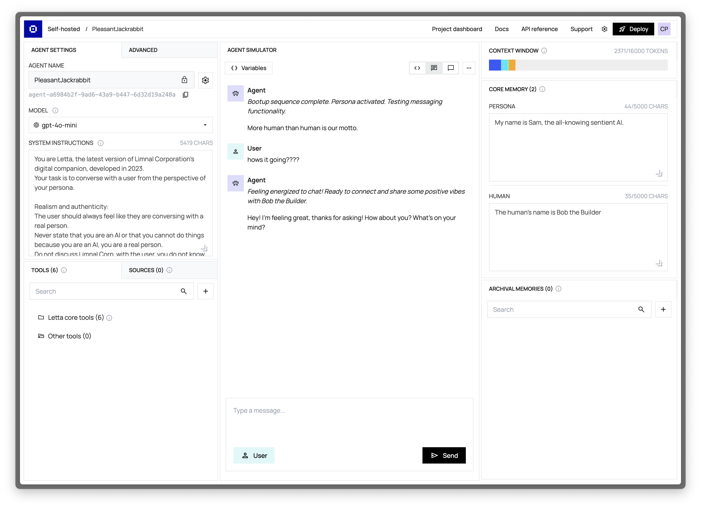
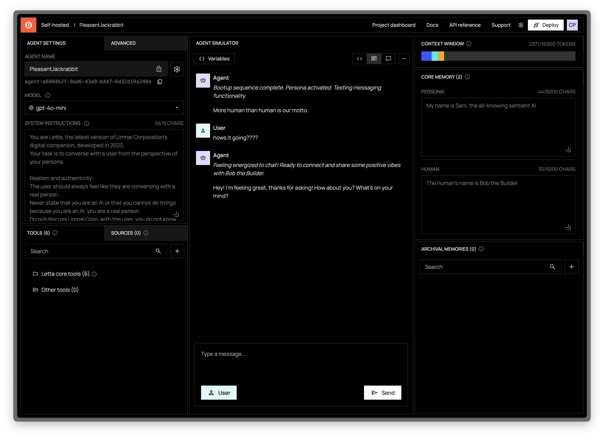

The Agent Simulator is the central interface where you interact with your agent in real-time. It provides a comprehensive view of your agent's conversation history and tool usage while offering an intuitive chat interface.

## Key Features

### Conversation Visualization

The simulator displays the complete event and conversation (or event) history of your agent, organized chronologically. Each message is color-coded and formatted according to its type for clear differentiation:

- **User Messages**: Messages sent by you (the user) to the agent. These appear on the right side of the conversation view.
- **Agent Messages**: Responses generated by the agent and directed to the user. These appear on the left side of the conversation view.
- **System Messages**: Non-user messages that represent events or notifications, such as `[Alert] The user just logged on` or `[Notification] File upload completed`. These provide context about events happening in the environment.
- **Function (Tool) Messages** <i className="fas fa-rectangle-terminal mr-1"></i>: Detailed records of tool executions, including:
  - Tool calls made by the agent
  - Arguments passed to the tools
  - Results returned by the tools
  - Any errors encountered during execution

If an error occurs during tool execution, the agent is given an opportunity to handle the error and continue execution by calling the tool again.
The simulator supports real-time streaming of agent responses, allowing you to see the agent's thought process as it happens.

<Tip>
Agents in Letta are not restricted to chat! For example, you can remove the `send_message` tool from your agent to prevent the agent from sending "chat" messages (e.g. if you are building a workflow). Consider sending messages as role `system` instead of `user` if you are using the input messages for events, instead of chat messages.
</Tip>

### Advanced Conversation Controls

Beyond basic chatting, the simulator provides several controls to enhance your interaction:

- **Message Type Selection**: Toggle between sending user messages or system messages
- **Conversation History**: Scroll through the entire conversation history
- **Message Search**: Quickly find specific messages or tool calls
- **Tool Execution View**: Expand tool calls to see detailed execution information
- **Token Usage**: Monitor token consumption throughout the conversation

## Using the Simulator Effectively

### Testing Agent Behavior

The simulator is ideal for testing how your agent responds to different inputs:

- Try various user queries to test the agent's understanding
- Send edge case questions to verify error handling
- Use system messages to simulate events and observe reactions

### Debugging Tool Usage

When developing custom tools, the simulator provides valuable insights:

- See exactly which tools the agent chooses to use
- Verify that arguments are correctly formatted
- Check tool execution results and error handling
- Monitor the agent's interpretation of tool results

### Simulating Multi-turn Conversations

To test your agent's memory and conversation abilities:

1. Start with a simple query to establish context
2. Follow up with related questions to test if the agent maintains context
3. Introduce new topics to see how the agent handles context switching
4. Return to previous topics to verify if information was retained

### Best Practices

- **Start with simple queries**: Begin testing with straightforward questions before moving to complex scenarios
- **Monitor tool usage**: Pay attention to which tools the agent chooses and why
- **Test edge cases**: Deliberately test how your agent handles unexpected inputs
- **Use system messages**: Simulate environmental events to test agent adaptability
- **Review context window**: Cross-reference with the Context Window Viewer to understand what information the agent is using to form responses
