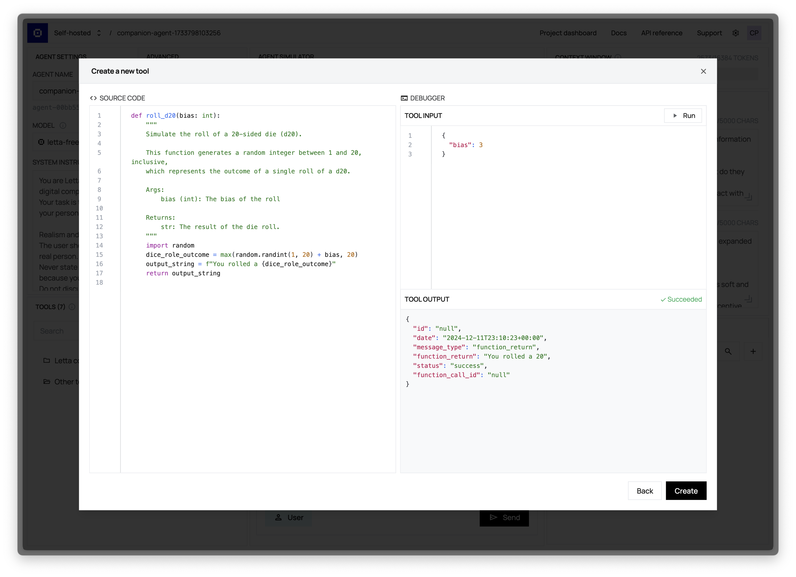
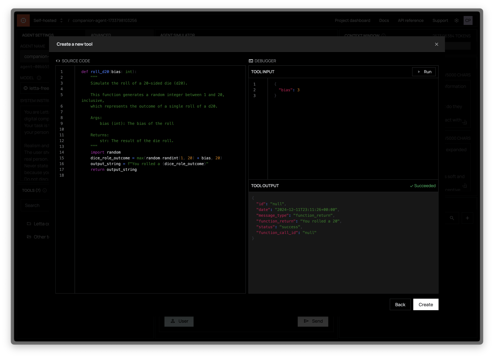

The Tools panel in the ADE provides a comprehensive interface for managing the tools available to your agent. These tools define what capabilities your agent has beyond conversation, enabling it to perform actions, access information, and interact with external systems.

## Managing Agent Tools

### Viewing Current Tools

The Tools panel displays all tools currently attached to your agent, showing both built-in Letta tool (which can be detached), as well as custom tools that you have created and attached to the agent.

### Adding Tools

Adding tools to your agent is a straightforward process:

1. Click the "Add Tool" button in the Tools panel
2. Browse the tool library or search for specific tools
3. Select a tool to view its details
4. Click "Add to Agent" to attach it

The tool will immediately become available to your agent without requiring a restart or recreation of the agent.

### Removing Tools

To remove a tool from your agent:

1. Locate the tool in the Tools panel
2. Click the three-dot menu next to the tool
3. Select "Remove Tool"

The tool will be detached from your agent but remains in your tool library for future use.

## Creating Custom Tools

For more information on creating custom tools, see our main [tools documentation](/guides/agents/tools).

<Note>
Tools must have typed arguments and valid docstrings (including docs for all arguments) to be processed properly by the Letta server. This documentation helps the agent understand when and how to use the tool.
</Note>

### Live Tool Testing Environment

One of the most powerful features of the ADE is the ability to test tools as you build them:

1. Write your tool implementation
2. Enter test arguments in the JSON input field
3. Click "Run" to execute the tool in a sandboxed environment
4. View the results or error messages
5. Refine your implementation and test again

This real-time testing capability dramatically speeds up tool development and debugging.
