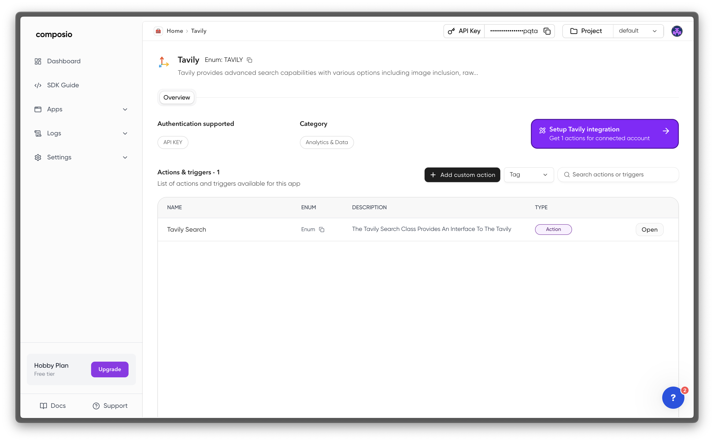
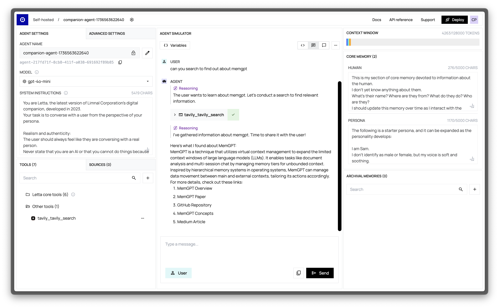
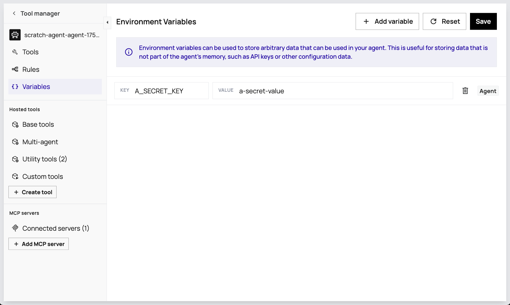

<Warning>
The Letta Composio integration (via the Composio API endpoints) is deprecated and will be removed in a future release. If you would like to use Composio tools, we recommend using them via our native [MCP integration](/guides/mcp/overview) instead.
</Warning>

## Composio integration (deprecated)

<Tip>
If you're getting an error when calling Composio tools that says "*Could not find connection... entity=default*",
go to [Composio's website](https://app.composio.dev/connections) to check your `ENTITY ID`.
If it's not `default`, then you need to set a tool variable `COMPOSIO_ENTITY` to your `ENTITY ID` value (see [here](#using-entities-in-composio-tools)).
</Tip>

[Composio](https://docs.composio.dev) is an external tool service that makes it easy to connect Letta agents to popular services via custom tools.
For example, you can use Composio tools to connect Letta agents to Google, GitHub, Slack, Cal.com, and [many more services](https://composio.dev/tools).

Composio makes agent authentication to third party platforms easy.
To use Composio, you need to create an account at [composio.dev](https://composio.dev) and create a Composio API key.

Once you have a Composio API key, you can connect it to Letta to allow your Letta agents to use Composio tools.
Composio's free tier gives you 2000 API calls per month.

## Connecting Composio Tools to Letta Agents
Once you have a Composio API key, you can register it with the Letta server using the environment variable `COMPOSIO_API_KEY`.

If you're self-hosting a Letta server ([instructions](guides/server/docker)), you would pass this environment variable to `docker run`:
```bash
docker run \
  -v ~/.letta/.persist/pgdata:/var/lib/postgresql/data \
  -p 8283:8283 \
  -e OPENAI_API_KEY="your_openai_api_key" \
  -e COMPOSIO_API_KEY="your_composio_api_key" \
  letta/letta:latest
```

In Letta Cloud, you can set your `COMPOSIO_API_KEY` under **Settings** > **Integrations** > **Composio**.

## Adding Composio tools via the ADE
Once you've connected your `COMPOSIO_API_KEY` to the Letta server (or Letta Cloud), you will be able to view Composio tools when you click the **Add Tool** button (the + button in the bottom left tools panel).


<Warning>
If you did not successfully pass your `COMPOSIO_API_KEY` to the Letta server, you'll see the following message when you browse Composio tools:
"To attach this tool and 4000+ other tools to your agent, connect to Composio"
</Warning>

### Authenticating a Tool in Composio
In order for the tool to function properly, you must have first authenticated the tool on Composio's website. For example, for Tavily, we need to provide Composio our Tavily API key.

To do this, you can click the **View on Composio** button and follow the instructions on Composio's website to authenticate the tool.


### Attaching a Tool to a Letta Agent
To give your agent access to the tool, you need to click **Attach Tool**. Once the tool is successfully attached (you will see it in the tools panel in the main ADE view), your agent will be able to use the tool.
Let's try getting the example agent to use the Tavily search tool:


If we click on the tool execution button in the chat, we can see the exact inputs to the Composio tool, and the exact outputs from the tool:


## Using entities in Composio tools
<Tip>
To set a tool variable, click "**Variables**" in the Agent Simulator (center column, top), then click "**Add new tool variable**". Once you've added the variable, click "**Update tool variables**" to save.
</Tip>
In Composio tool execution is associated with an `ENTITY ID`.
By default, this is `default` - you can check what your `ENTITY ID` is by going to [the connections page on Composio's website](https://app.composio.dev/connections).
In Letta, you can set the `ENTITY ID` in Composio through the use of tool variables - specifically, the variable `COMPOSIO_ENTITY`.

If your `ENTITY ID` is not `default`, then in order for your Composio tools to work in Letta, you need to create a **[tool variable](/guides/agents/tool-variables)** called `COMPOSIO_ENTITY` and set it to be your Composio `ENTITY ID`. If you don't set `COMPOSIO_ENTITY`, Letta will default to assuming it is `default`.


You can also assign tool variables on agent creation in the API with the `tool_exec_environment_variables` parameter (see [examples here](/guides/agents/tool-variables)).

## Entities in Composio tools for multi-user
In multi-user settings (where you have many users all using different agents), you may want to use the concept of [entities](https://docs.composio.dev/patterns/Auth/connected_account#entities) in Composio, which allow you to scope Composio tool execution to specific users.

For example, let's say you're using Letta to create an application where users each get their own personal secretary that can schedule their calendar. As a developer, you only have one `COMPOSIO_API_KEY` to manage the connection between Letta and Composio, but you want to make associate each Composio tool call from a specific agent with a specific user.

Composio allows you to do this through **entities**: each **user** on your Composio account will have a unique Composio entity ID, and in Letta each **agent** will be associated with a specific Composio entity ID.

## Adding Composio tools to agents in the Python SDK
<Note>
Adding Composio tools to agents is supported in the Python SDK, but not the TypeScript SDK.
</Note>

To use Letta with [Composio](https://docs.composio.dev) tools, make sure you install dependencies with `pip install 'letta[external-tools]`. Then, make sure you log in to Composio:
```bash title="shell"
composio login
```

Next, depending on your desired Composio tool, you need to add the necessary authentication via `composio add` (for example, to connect GitHub tools):
```bash title="shell"
composio add github
```
To attach a Composio tool to an agent, you must first create a Letta tool from composio by specifying the action name:
```python title="python"
from composio import Action

# create a Letta tool object
tool = client.tools.add_composio_tool(
  composio_action_name=Action.GITHUB_STAR_A_REPOSITORY_FOR_THE_AUTHENTICATED_USER.name
)
```
Below is a full example of creating a Letta agent that can start a Github repository.
```python title="python" maxLines=50
from letta_client import Letta
from composio import Action

client = Letta(base_url="http://localhost:8283")

# add a composio tool
tool = client.tools.add_composio_tool(composio_action_name=Action.GITHUB_STAR_A_REPOSITORY_FOR_THE_AUTHENTICATED_USER.name)

# create an agent with the tool
agent = client.agents.create(
    name="file_editing_agent",
    memory_blocks=[
        {"label": "persona", "value": "I am a helpful assistant"}
    ],
    model="anthropic/claude-3-5-sonnet-20241022",
    embedding="openai/text-embedding-3-small",
    tool_ids=[tool.id]
)
print("Agent tools", [tool.name for tool in agent.tools])

# message the agent
response = client.agents.messages.create(
    agent_id=agent.id,
    messages=[
        {
            "role": "user",
            "content": "Star the github repo `letta` by `letta-ai`"
        }
    ]
)
for message in response.messages:
    print(message)
```
