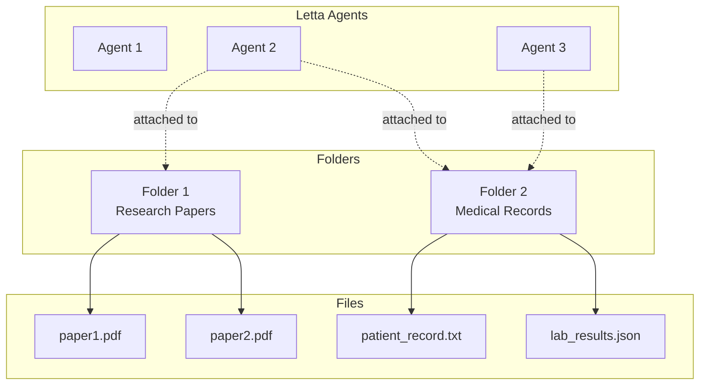

Letta's filesystem allow you to easily connect your agents to external files, for example: research papers, reports, medical records, or any other data in common text formats (`.pdf`, `.txt`, `.md`, `.json`, etc.).
To upload a file, you must create a folder (with a name and description) to upload files to, which can be done through the ADE or API.



Once a file has been uploaded to a folder, the agent can access it using a set of **file tools**.
The file is automatically chunked and embedded to allow the agent to use semantic search to find relevant information in the file (in addition to standard text-based search).

<Tip>
If you've used [Claude Projects](https://www.anthropic.com/news/projects) before, you can think of a **folder** in Letta as a "project", except in Letta you can connect a single agent to multiple projects (in Claude Projects, a chat session can only be associated with a single project).
</Tip>

## File tools

When a folder is attached to an agent, Letta automatically attaches a set of file tools to the agent:
* `open_file`: Open a file to a specific location
* `grep_file`: Search a file using a regular expression
* `search_file`: Search a file using semantic (embedding-based) search

To detach these tools from your agent, simply detach all your folders, the file tools will be automatically removed.

## Creating a folder

### ADE

To create a folder click the "Filesystem" tab in the bottom-left of the ADE, then click the "create folder" button. When you create a folder inside the ADE, it will be automatically attached to your agent.

### API / SDK

To create a folder, you will need to specify a unique `name` as well as an `EmbeddingConfig`:
<CodeGroup>
```python title="python"
# get an available embedding_config
embedding_configs = client.embedding_models.list()
embedding_config = embedding_configs[0]

# create the folder
folder = client.folders.create(
    name="my_folder",
    embedding_config=embedding_config
)
```
```typescript title="node.js"
// get an available embedding_config
const embeddingConfigs = await client.embeddingModels.list()
const embeddingConfig = embeddingConfigs[0];

// create the folder
const folder = await client.folders.create({
    name: "my_folder",
    embeddingConfig: embeddingConfig
});
```
</CodeGroup>
Now that you've created the folder, you can start loading data into the folder.

## Uploading a file into a folder

### ADE

Click the "Filesystem" tab in the bottom-left of the ADE to view your attached folders.
To upload a file, simply drag and drop the file into the folders tab, or click the upload (+) button.

### API / SDK

Uploading a file to a folder will create an async job for processing the file, which will split the file into chunks and embed them.
<CodeGroup>
```python title="python"
# upload a file into the folder
job = client.folders.files.upload(
    folder_id=folder.id,
    file=open("my_file.txt", "rb")
)

# wait until the job is completed
while True:
    job = client.jobs.retrieve(job.id)
    if job.status == "completed":
        break
    elif job.status == "failed":
        raise ValueError(f"Job failed: {job.metadata}")
    print(f"Job status: {job.status}")
    time.sleep(1)
```
```typescript title="node.js"
// upload a file into the folder
const uploadJob = await client.folders.files.upload(
    createReadStream("my_file.txt"),
    folder.id,
);
console.log("file uploaded")

// wait until the job is completed
while (true) {
    const job = await client.jobs.retrieve(uploadJob.id);
    if (job.status === "completed") {
        break;
    } else if (job.status === "failed") {
        throw new Error(`Job failed: ${job.metadata}`);
    }
    console.log(`Job status: ${job.status}`);
    await new Promise((resolve) => setTimeout(resolve, 1000));
}
```
</CodeGroup>
Once the job is completed, you can list the files and the generated passages in the folder:
<CodeGroup>
```python title="python"
# list files in the folder
files = client.folders.files.list(folder_id=folder.id)
print(f"Files in folder: {files}")

# list passages in the folder
passages = client.folders.passages.list(folder_id=folder.id)
print(f"Passages in folder: {passages}")
```
```typescript title="node.js"
// list files in the folder
const files = await client.folders.files.list(folder.id);
console.log(`Files in folder: ${files}`);

// list passages in the folder
const passages = await client.folders.passages.list(folder.id);
console.log(`Passages in folder: ${passages}`);
```
</CodeGroup>

## Listing available folders
You can view available folders by listing them:
<CodeGroup>
```python title="python"
# list folders
folders = client.folders.list()
```
```typescript title="node.js"
// list folders
const folders = await client.folders.list();
```
</CodeGroup>

## Connecting a folder to an agent

When you attach a folder to an agent, the files inside the folder will become visible inside the agent's context window.
By default, only a limited "window" of the file will be visible to prevent context window overflow - the agent can use the file tools to browse through the files and search for information.

## Attaching the folder

### ADE

When you create a folder inside the ADE, it will be automatically attached to your agent.
You can also attach existing folders by clicking the "attach existing" button in the filesystem tab.

### API / SDK

You can attach a folder to an agent by specifying both the folder and agent IDs:
<CodeGroup>
```python title="python"
client.agents.folders.attach(agent_id=agent.id, folder_id=folder.id)
```
```typescript title="node.js"
await client.agents.folders.attach(agent.id, folder.id);
```
</CodeGroup>
Note that your agent and folder must be configured with the same embedding model, to ensure that the agent is able to search accross a common embedding space for archival memory.

## Detaching the folder

### ADE

To detach a folder from an agent, click the "detach" button in the folders tab.

### API / SDK

Detaching a folder will remove the files from the agent's context window:
<CodeGroup>
```python title="python"
client.agents.folders.detach(agent_id=agent.id, folder_id=folder.id)
```
```typescript title="node.js"
await client.agents.folders.detach(agent.id, folder.id);
```
</CodeGroup>
