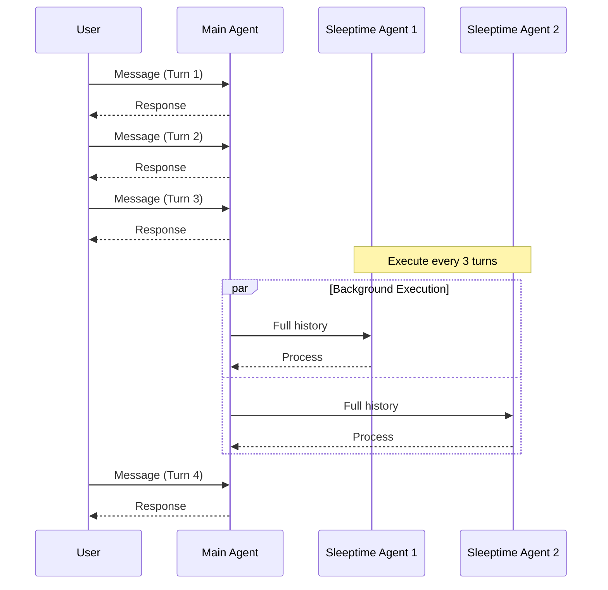
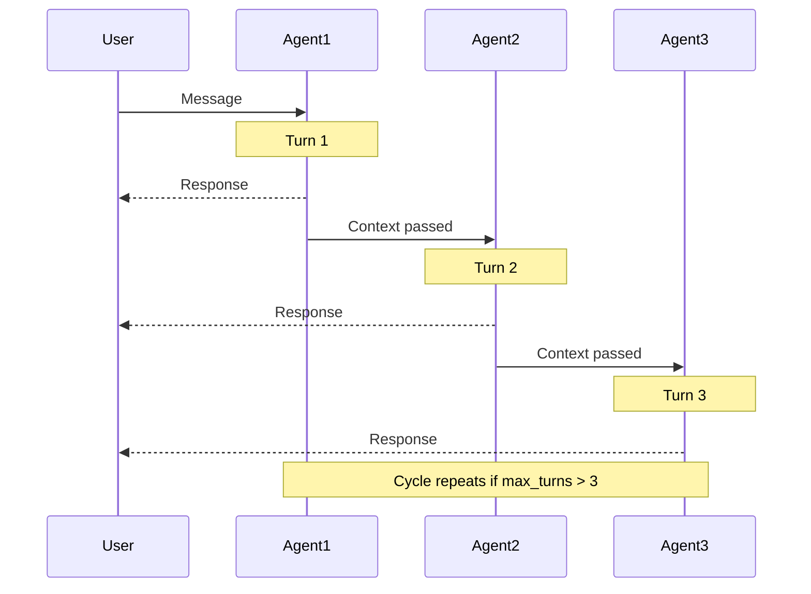
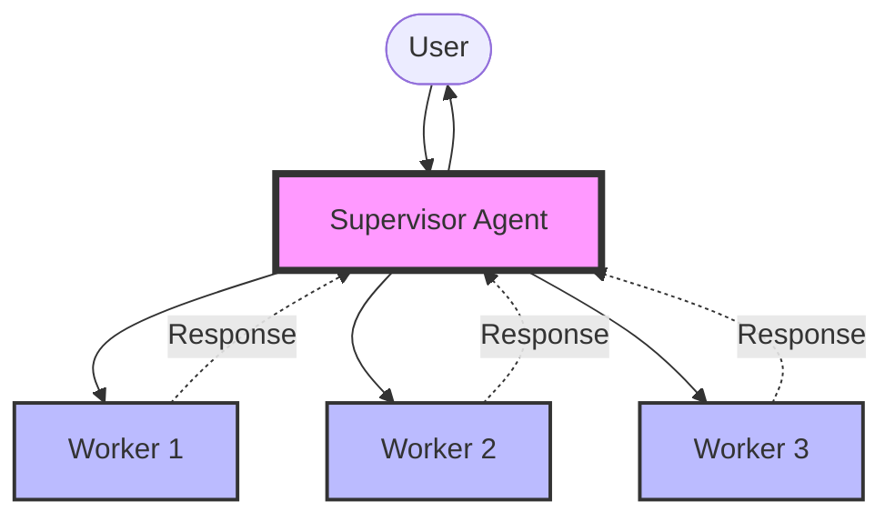
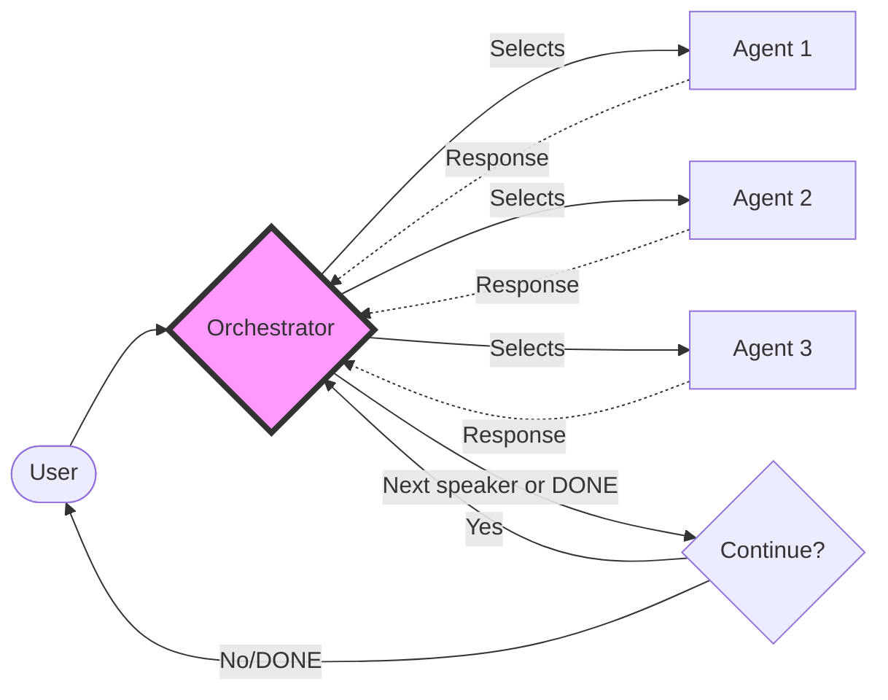

<Callout type="info" emoji="🚀">
Groups are a new feature in Letta and the specification is actively evolving. If you need support, please chat with us on [Discord](https://discord.gg/letta).
</Callout>

Groups enable sophisticated multi-agent coordination patterns in Letta. Each group type provides a different communication and execution pattern, allowing you to choose the right architecture for your multi-agent system.

### Choosing the Right Group Type

| Group Type | Best For | Key Features |
|------------|----------|--------------|
| **Sleep-time** | Background monitoring, periodic tasks | Main + background agents, configurable frequency |
| **Round Robin** | Equal participation, structured discussions | Sequential, predictable, no orchestrator needed |
| **Supervisor** | Parallel task execution, work distribution | Centralized control, parallel processing, result aggregation |
| **Dynamic** | Context-aware routing, complex workflows | Flexible, adaptive, orchestrator-driven |
| **Handoff** | Specialized routing, expertise-based delegation | Task-based transfers (coming soon) |

### Working with Groups

All group types follow a similar creation pattern using the SDK:
1. Create individual agents with their specific roles and personas
2. Create a group with the appropriate manager configuration
3. Send messages to the group for coordinated multi-agent interaction

Groups can be managed through the Letta API or SDKs:
- List all groups: `client.groups.list()`
- Retrieve a specific group: `client.groups.retrieve(group_id)`
- Update group configuration: `client.groups.update(group_id, update_config)`
- Delete a group: `client.groups.delete(group_id)`

## Sleep-time

The Sleep-time pattern enables background agents to execute periodically while a main conversation agent handles user interactions. This is based on our [sleep-time compute research](https://arxiv.org/abs/2504.13171).

<Note>
For an in-depth guide on sleep-time agents, including conversation processing and data source integration, see our [Sleep-time Agents documentation](/guides/agents/architectures/sleeptime).
</Note>

### How it works
- A main conversation agent handles direct user interactions
- Sleeptime agents execute in the background every Nth turn
- Background agents have access to the full message history
- Useful for periodic tasks like monitoring, data collection, or summary generation
- Frequency of background execution is configurable



### Code Example

<CodeGroup>
```python title="python" maxLines=50
from letta_client import Letta, SleeptimeManager

client = Letta()

# Create main conversation agent
main_agent = client.agents.create(
    model="openai/gpt-4.1",
    memory_blocks=[
        {"label": "persona", "value": "I am the main conversation agent"}
    ]
)

# Create sleeptime agents for background tasks
monitor_agent = client.agents.create(
    model="openai/gpt-4.1",
    memory_blocks=[
        {"label": "persona", "value": "I monitor conversation sentiment and key topics"}
    ]
)

summary_agent = client.agents.create(
    model="openai/gpt-4.1",
    memory_blocks=[
        {"label": "persona", "value": "I create periodic summaries of the conversation"}
    ]
)

# Create a Sleeptime group
group = client.groups.create(
    agent_ids=[monitor_agent.id, summary_agent.id],
    description="Background agents that process conversation periodically",
    manager_config=SleeptimeManager(
        manager_agent_id=main_agent.id,
        sleeptime_agent_frequency=3  # Execute every 3 turns
    )
)

# Send messages to the group
response = client.groups.messages.create(
    group_id=group.id,
    messages=[
        {"role": "user", "content": "Let's discuss our project roadmap"}
    ]
)
```

```typescript title="node.js" maxLines=50
import { LettaClient } from '@letta-ai/letta-client';

const client = new LettaClient();

// Create main conversation agent
const mainAgent = await client.agents.create({
    model: "openai/gpt-4.1",
    memoryBlocks: [
        {label: "persona", value: "I am the main conversation agent"}
    ]
});

// Create sleeptime agents for background tasks
const monitorAgent = await client.agents.create({
    model: "openai/gpt-4.1",
    memoryBlocks: [
        {label: "persona", value: "I monitor conversation sentiment and key topics"}
    ]
});

const summaryAgent = await client.agents.create({
    model: "openai/gpt-4.1",
    memoryBlocks: [
        {label: "persona", value: "I create periodic summaries of the conversation"}
    ]
});

// Create a Sleeptime group
const group = await client.groups.create({
    agentIds: [monitorAgent.id, summaryAgent.id],
    description: "Background agents that process conversation periodically",
    managerConfig: {
        managerType: "sleeptime",
        managerAgentId: mainAgent.id,
        sleeptimeAgentFrequency: 3  // Execute every 3 turns
    }
});

// Send messages to the group
const response = await client.groups.messages.create(
    group.id,
    {
        messages: [{role: "user", content: "Let's discuss our project roadmap"}]
    }
);
```
</CodeGroup>

## RoundRobin

The RoundRobin group cycles through each agent in the group in the specified order. This pattern is useful for scenarios where each agent needs to contribute equally and in sequence.

### How it works
- Cycles through agents in the order they were added to the group
- Every agent has access to the full conversation history
- Each agent can choose whether or not to respond when it's their turn
- Default ensures each agent gets one turn, but max turns can be configured
- Does not require an orchestrator agent



### Code Example

<CodeGroup>
```python title="python" maxLines=50
from letta_client import Letta, RoundRobinManager

client = Letta()

# Create agents for the group
agent1 = client.agents.create(
    model="openai/gpt-4.1",
    memory_blocks=[
        {"label": "persona", "value": "I am the first agent in the group"}
    ]
)

agent2 = client.agents.create(
    model="openai/gpt-4.1",
    memory_blocks=[
        {"label": "persona", "value": "I am the second agent in the group"}
    ]
)

agent3 = client.agents.create(
    model="openai/gpt-4.1",
    memory_blocks=[
        {"label": "persona", "value": "I am the third agent in the group"}
    ]
)

# Create a RoundRobin group
group = client.groups.create(
    agent_ids=[agent1.id, agent2.id, agent3.id],
    description="A group that cycles through agents in order",
    manager_config=RoundRobinManager(
        max_turns=3  # Optional: defaults to number of agents
    )
)

# Send a message to the group
response = client.groups.messages.create(
    group_id=group.id,
    messages=[
        {"role": "user", "content": "Hello group, what are your thoughts on this topic?"}
    ]
)
```

```typescript title="node.js" maxLines=50
import { LettaClient } from '@letta-ai/letta-client';

const client = new LettaClient();

// Create agents for the group
const agent1 = await client.agents.create({
    model: "openai/gpt-4.1",
    memoryBlocks: [
        {label: "persona", value: "I am the first agent in the group"}
    ]
});

const agent2 = await client.agents.create({
    model: "openai/gpt-4.1",
    memoryBlocks: [
        {label: "persona", value: "I am the second agent in the group"}
    ]
});

const agent3 = await client.agents.create({
    model: "openai/gpt-4.1",
    memoryBlocks: [
        {label: "persona", value: "I am the third agent in the group"}
    ]
});

// Create a RoundRobin group
const group = await client.groups.create({
    agentIds: [agent1.id, agent2.id, agent3.id],
    description: "A group that cycles through agents in order",
    managerConfig: {
        managerType: "round_robin",
        maxTurns: 3  // Optional: defaults to number of agents
    }
});

// Send a message to the group
const response = await client.groups.messages.create(
    group.id,
    {
        messages: [{role: "user", content: "Hello group, what are your thoughts on this topic?"}]
    }
);
```
</CodeGroup>

## Supervisor

The Supervisor pattern uses a manager agent to coordinate worker agents. The supervisor forwards prompts to all workers and aggregates their responses.

### How it works
- A designated supervisor agent manages the group
- Supervisor forwards messages to all worker agents simultaneously
- Worker agents process in parallel and return responses
- Supervisor aggregates all responses and returns to the user
- Ideal for parallel task execution and result aggregation



### Code Example

<CodeGroup>
```python title="python" maxLines=50
from letta_client import Letta, SupervisorManager

client = Letta()

# Create supervisor agent
supervisor = client.agents.create(
    model="openai/gpt-4.1",
    memory_blocks=[
        {"label": "persona", "value": "I am a supervisor managing multiple workers"}
    ]
)

# Create worker agents
worker1 = client.agents.create(
    model="openai/gpt-4.1",
    memory_blocks=[
        {"label": "persona", "value": "I am a data analysis specialist"}
    ]
)

worker2 = client.agents.create(
    model="openai/gpt-4.1",
    memory_blocks=[
        {"label": "persona", "value": "I am a research specialist"}
    ]
)

worker3 = client.agents.create(
    model="openai/gpt-4.1",
    memory_blocks=[
        {"label": "persona", "value": "I am a writing specialist"}
    ]
)

# Create a Supervisor group
group = client.groups.create(
    agent_ids=[worker1.id, worker2.id, worker3.id],
    description="A supervisor-worker group for parallel task execution",
    manager_config=SupervisorManager(
        manager_agent_id=supervisor.id
    )
)

# Send a message to the group
response = client.groups.messages.create(
    group_id=group.id,
    messages=[
        {"role": "user", "content": "Analyze this data and prepare a report"}
    ]
)
```

```typescript title="node.js" maxLines=50
import { LettaClient } from '@letta-ai/letta-client';

const client = new LettaClient();

// Create supervisor agent
const supervisor = await client.agents.create({
    model: "openai/gpt-4.1",
    memoryBlocks: [
        {label: "persona", value: "I am a supervisor managing multiple workers"}
    ]
});

// Create worker agents
const worker1 = await client.agents.create({
    model: "openai/gpt-4.1",
    memoryBlocks: [
        {label: "persona", value: "I am a data analysis specialist"}
    ]
});

const worker2 = await client.agents.create({
    model: "openai/gpt-4.1",
    memoryBlocks: [
        {label: "persona", value: "I am a research specialist"}
    ]
});

const worker3 = await client.agents.create({
    model: "openai/gpt-4.1",
    memoryBlocks: [
        {label: "persona", value: "I am a writing specialist"}
    ]
});

// Create a Supervisor group
const group = await client.groups.create({
    agentIds: [worker1.id, worker2.id, worker3.id],
    description: "A supervisor-worker group for parallel task execution",
    managerConfig: {
        managerType: "supervisor",
        managerAgentId: supervisor.id
    }
});

// Send a message to the group
const response = await client.groups.messages.create(
    group.id,
    {
        messages: [{role: "user", content: "Analyze this data and prepare a report"}]
    }
);
```
</CodeGroup>

## Dynamic

The Dynamic pattern uses an orchestrator agent to dynamically determine which agent should speak next based on the conversation context.

### How it works
- An orchestrator agent is invoked on every turn to select the next speaker
- Every agent has access to the full message history
- Agents can choose not to respond when selected
- Supports a termination token to end the conversation
- Maximum turns can be configured to prevent infinite loops



### Code Example

<CodeGroup>
```python title="python" maxLines=100
from letta_client import Letta, DynamicManager

client = Letta()

# Create orchestrator agent
orchestrator = client.agents.create(
    model="openai/gpt-4.1",
    memory_blocks=[
        {"label": "persona", "value": "I am an orchestrator that decides who speaks next based on context"}
    ]
)

# Create participant agents
expert1 = client.agents.create(
    model="openai/gpt-4.1",
    memory_blocks=[
        {"label": "persona", "value": "I am a technical expert"}
    ]
)

expert2 = client.agents.create(
    model="openai/gpt-4.1",
    memory_blocks=[
        {"label": "persona", "value": "I am a business strategist"}
    ]
)

expert3 = client.agents.create(
    model="openai/gpt-4.1",
    memory_blocks=[
        {"label": "persona", "value": "I am a creative designer"}
    ]
)

# Create a Dynamic group
group = client.groups.create(
    agent_ids=[expert1.id, expert2.id, expert3.id],
    description="A dynamic group where the orchestrator chooses speakers",
    manager_config=DynamicManager(
        manager_agent_id=orchestrator.id,
        termination_token="DONE!",  # Optional: default is "DONE!"
        max_turns=10  # Optional: prevent infinite loops
    )
)

# Send a message to the group
response = client.groups.messages.create(
    group_id=group.id,
    messages=[
        {"role": "user", "content": "Let's design a new product. Who should start?"}
    ]
)
```

```typescript title="node.js" maxLines=100
import { LettaClient } from '@letta-ai/letta-client';

const client = new LettaClient();

// Create orchestrator agent
const orchestrator = await client.agents.create({
    model: "openai/gpt-4.1",
    memoryBlocks: [
        {label: "persona", value: "I am an orchestrator that decides who speaks next based on context"}
    ]
});

// Create participant agents
const expert1 = await client.agents.create({
    model: "openai/gpt-4.1",
    memoryBlocks: [
        {label: "persona", value: "I am a technical expert"}
    ]
});

const expert2 = await client.agents.create({
    model: "openai/gpt-4.1",
    memoryBlocks: [
        {label: "persona", value: "I am a business strategist"}
    ]
});

const expert3 = await client.agents.create({
    model: "openai/gpt-4.1",
    memoryBlocks: [
        {label: "persona", value: "I am a creative designer"}
    ]
});

// Create a Dynamic group
const group = await client.groups.create({
    agentIds: [expert1.id, expert2.id, expert3.id],
    description: "A dynamic group where the orchestrator chooses speakers",
    managerConfig: {
        managerType: "dynamic",
        managerAgentId: orchestrator.id,
        terminationToken: "DONE!",  // Optional: default is "DONE!"
        maxTurns: 10  // Optional: prevent infinite loops
    }
});

// Send a message to the group
const response = await client.groups.messages.create(
    group.id,
    {
        messages: [{role: "user", content: "Let's design a new product. Who should start?"}]
    }
);
```
</CodeGroup>

## Handoff (Coming Soon)

The Handoff pattern will enable agents to explicitly transfer control to other agents based on task requirements or expertise areas.

### Planned Features
- Agents can hand off conversations to specialists
- Context and state preservation during handoffs
- Support for both orchestrated and peer-to-peer handoffs
- Automatic routing based on agent capabilities

## Best Practices
- Choose the group type that matches your coordination needs
- Configure appropriate max turns to prevent infinite loops
- Use shared memory blocks for state that needs to be accessed by multiple agents
- Monitor group performance and adjust configurations as needed
