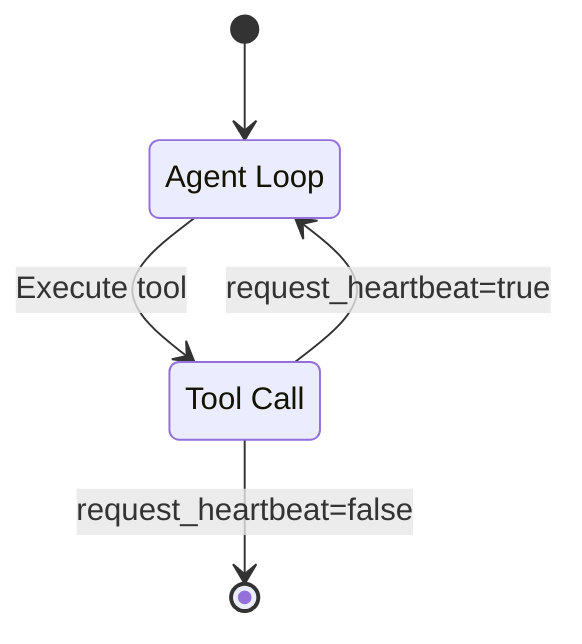

Heartbeats are a mechanism that enables Letta agents to chain multiple tool calls together in a single execution loop.
The term "heartbeat" was coined in the [MemGPT paper](https://arxiv.org/abs/2310.08560), and since the Letta codebase evolved from the original MemGPT codebase (same authors), **heartbeats** remain a core part of the default agent loop.

## How heartbeats work

Every tool in Letta automatically receives an additional parameter called `request_heartbeat`, which defaults to `false`. When an agent sets this parameter to `true`, it signals to the Letta server that it wants to continue executing after the current tool call completes.

## Technical implementation

When the Letta server detects that `request_heartbeat=true`, it:
1. Completes the current tool execution
2. Restarts the agent loop with a system message acknowledging the heartbeat request
3. Allows the agent to continue with an additional tool calls

This enables agents to perform complex, multi-step operations without requiring explicit user intervention between steps.

## Automatic heartbeats on failure

If a tool call fails at runtime, Letta automatically generates a heartbeat.
This gives the agent an opportunity to handle the error and potentially retry the operation with different parameters or take alternative actions.

## Viewing heartbeats in the ADE

In the [Agent Development Environment (ADE)](/guides/ade/overview), heartbeat requests are visible for all agent messages.
When a tool is called with `request_heartbeat=true`, you'll see a heartbeat indicator next to the tool call, making it easy to track when an agent is proactively chaining operations together.

## Learn more

To read more about the concept of heartbeats and their origins, refer to the original [MemGPT research paper](https://arxiv.org/abs/2310.08560).
