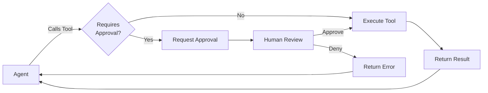

Human-in-the-loop (HITL) workflows allow you to maintain control over critical agent actions by requiring human approval before executing certain tools. This is essential for operations that could have significant consequences, such as database modifications, financial transactions, or external API calls with cost implications.



## Overview

When a tool is marked as requiring approval, the agent will pause execution and wait for human approval or denial before proceeding. This creates a checkpoint in the agent's workflow where human judgment can be applied. The approval workflow is designed to be non-blocking and supports both synchronous and streaming message interfaces, making it suitable for interactive applications as well as batch processing systems.

### Key Benefits

- **Risk Mitigation**: Prevent unintended actions in production environments
- **Cost Control**: Review expensive operations before execution
- **Compliance**: Ensure human oversight for regulated operations
- **Quality Assurance**: Validate agent decisions before critical actions

### How It Works

The approval workflow follows a clear sequence of steps that ensures human oversight at critical decision points:

1. **Tool Configuration**: Mark specific tools as requiring approval either globally (default for all agents) or per-agent
2. **Execution Pause**: When the agent attempts to call a protected tool, it immediately pauses and returns an approval request message
3. **Human Review**: The approval request includes the tool name, arguments, and context, allowing you to make an informed decision
4. **Approval/Denial**: Send an approval response to either execute the tool or provide feedback for the agent to adjust its approach
5. **Continuation**: The agent receives the tool result (on approval) or an error message (on denial) and continues processing


## Best Practices

Following these best practices will help you implement effective human-in-the-loop workflows while maintaining a good user experience and system performance.

### 1. Selective Tool Marking

Not every tool needs human approval. Be strategic about which tools require oversight to avoid workflow bottlenecks while maintaining necessary controls:

**Tools that typically require approval:**
- Database write operations (INSERT, UPDATE, DELETE)
- External API calls with financial implications
- File system modifications or deletions
- Communication tools (email, SMS, notifications)
- System configuration changes
- Third-party service integrations with rate limits

### 2. Clear Denial Reasons

When denying a request, your feedback directly influences how the agent adjusts its approach. Provide specific, actionable guidance rather than vague rejections:

```python
# Good: Specific and actionable
"reason": "Use read-only query first to verify the data before deletion"

# Bad: Too vague
"reason": "Don't do that"
```

The agent will use your denial reason to reformulate its approach, so the more specific you are, the better the agent can adapt.

## Setting Up Approval Requirements

There are two methods for configuring tool approval requirements, each suited for different use cases. Choose the approach that best fits your security model and operational needs.

### Method 1: Create/Upsert Tool with Default Approval Requirement

Set approval requirements at the tool level when creating or upserting a tool. This approach ensures consistent security policies across all agents that use the tool. The `default_requires_approval` flag will be applied to all future agent-tool attachments:

<CodeGroup>
```curl curl maxLines=50
curl --request POST \
  --url http://localhost:8283/v1/tools \
  --header 'Content-Type: application/json' \
  --data '{
    "name": "sensitive_operation",
    "default_requires_approval": true,
    "json_schema": {
      "type": "function",
      "function": {
        "name": "sensitive_operation",
        "parameters": {...}
      }
    },
    "source_code": "def sensitive_operation(...): ..."
  }'

# All agents using this tool will require approval
curl --request POST \
  --url http://localhost:8283/v1/agents \
  --header 'Content-Type: application/json' \
  --data '{
   "tools": ["sensitive_operation"],
   // ... other configuration
  }'
```
```python python maxLines=50
# Create a tool that requires approval by default
approval_tool = client.tools.upsert_from_function(
    func=sensitive_operation,
    default_requires_approval=True,
)

# All agents using this tool will require approval
agent = client.agents.create(
    tools=['sensitive_operation'],
    # ... other configuration
)
```
```typescript node.js maxLines=50
// Create a tool that requires approval by default
const approvalTool = await client.tools.upsert({
    name: "sensitive_operation",
    defaultRequiresApproval: true,
    jsonSchema: {
        type: "function",
        function: {
            name: "sensitive_operation",
            parameters: {...}
        }
    },
    sourceCode: "def sensitive_operation(...): ..."
});

// All agents using this tool will require approval
const agent = await client.agents.create({
    tools: ["sensitive_operation"],
    // ... other configuration
});
```
</CodeGroup>

### Method 2: Modify Existing Tool with Default Approval Requirement

<Note>
Modifying the tool-level setting will not retroactively apply to existing agent-tool attachments - it only sets the default for future attachments. This means that if the tool is already attached to an agent, the agent will continue using the tool without approval. To modify an existing agent-tool attachment, refer to Method 3 below.
</Note>

For an already existing tool, you can modify the tool to set approval requirements on future agent-tool attachments. The `default_requires_approval` flag will be applied to all future agent-tool attachments:

<CodeGroup>
```curl curl maxLines=50
curl --request PATCH \
  --url http://localhost:8283/v1/tools/$TOOL_ID \
  --header 'Content-Type: application/json' \
  --data '{
    "default_requires_approval": true
  }'

# All agents using this tool will require approval
curl --request POST \
  --url http://localhost:8283/v1/agents \
  --header 'Content-Type: application/json' \
  --data '{
   "tools": ["sensitive_operation"],
   // ... other configuration
  }'
```
```python python maxLines=50
# Create a tool that requires approval by default
approval_tool = client.tools.modify(
    tool_id=sensitive_operation.id,
    default_requires_approval=True,
)

# All agents using this tool will require approval
agent = client.agents.create(
    tools=['sensitive_operation'],
    # ... other configuration
)
```
```typescript node.js maxLines=50
// Create a tool that requires approval by default
const approvalTool = await client.tools.modify({
    tool_id=sensitive_operation.id,
    defaultRequiresApproval: true,
});

// All agents using this tool will require approval
const agent = await client.agents.create({
    tools: ["sensitive_operation"],
    // ... other configuration
});
```
</CodeGroup>

### Method 3: Per-Agent Tool Approval

Configure approval requirements for specific agent-tool combinations, allowing fine-grained control over individual agent behaviors. This method is particularly useful for:

- **Trusted agents**: Remove approval requirements for well-tested, reliable agents
- **Progressive autonomy**: Gradually reduce approval requirements as agents prove reliable
- **Override defaults**: Change the approval setting for tools already attached to an agent

Use the following endpoints to modify approval settings for existing agent-tool relationships:

<CodeGroup>
```curl curl maxLines=50
curl --request PATCH \
  --url http://localhost:8283/v1/agents/$AGENT_ID/tools/$TOOL_NAME/approval \
  --header 'Content-Type: application/json' \
  --data '{
    "requires_approval": true
  }'
```
```python python maxLines=50
# Modify approval requirement for a specific agent
client.agents.tools.modify_approval(
    agent_id=agent.id,
    tool_name="database_write",
    requires_approval=True,
)

# Check current approval settings
tools = client.agents.tools.list(agent_id=agent.id)
for tool in tools:
    print(f"{tool.name}: requires_approval={tool.requires_approval}")
```
```typescript node.js maxLines=50
// Modify approval requirement for a specific agent
await client.agents.tools.modifyApproval({
    agentId: agent.id,
    toolName: "database_write",
    requiresApproval: true,
});

// Check current approval settings
const tools = await client.agents.tools.list({
    agentId: agent.id,
});
for (const tool of tools) {
    console.log(`${tool.name}: requires_approval=${tool.requiresApproval}`);
}
```
</CodeGroup>

## Handling Approval Requests

### Step 1: Agent Requests Approval

When the agent attempts to call a tool that requires approval, execution immediately pauses. The agent returns a special approval request message containing:

- **Tool name**: The specific tool being called
- **Arguments**: The exact parameters the agent intends to pass
- **Tool call ID**: A unique identifier for tracking this specific call
- **Message ID**: The approval request ID needed for your response
- **Stop reason**: Set to `"requires_approval"` to indicate the pause state

This format matches the ToolCallMessage format intentionally, so that we can handle approval requests the same way we handle tool calls. Here's what an approval request looks like in practice:

<CodeGroup>
```curl curl maxLines=50
curl --request POST \
  --url http://localhost:8283/v1/agents/$AGENT_ID/messages \
  --header 'Content-Type: application/json' \
  --data '{
    "messages": [{
      "role": "user",
      "content": "Delete all test data from the database"
    }]
  }'

# Response includes approval request
{
  "messages": [
    {
      "message_type": "reasoning_message",
      "reasoning": "I need to delete test data from the database..."
    },
    {
      "message_type": "approval_request_message",
      "id": "message-abc123",
      "tool_call": {
        "name": "database_write",
        "arguments": "{\"query\": \"DELETE FROM test_data\"}",
        "tool_call_id": "tool-xyz789"
      }
    }
  ],
  "stop_reason": "requires_approval"
}
```
```python python maxLines=50
response = client.agents.messages.create(
    agent_id=agent.id,
    messages=[{
        "role": "user",
        "content": "Delete all test data from the database"
    }]
)

# Response includes approval request
{
  "messages": [
    {
      "message_type": "reasoning_message",
      "reasoning": "I need to delete test data from the database..."
    },
    {
      "message_type": "approval_request_message",
      "id": "message-abc123",
      "tool_call": {
        "name": "database_write",
        "arguments": "{\"query\": \"DELETE FROM test_data\"}",
        "tool_call_id": "tool-xyz789"
      }
    }
  ],
  "stop_reason": "requires_approval"
}
```
```typescript node.js maxLines=50
const response = await client.agents.messages.create({
    agentId: agent.id,
    requestBody: {
        messages: [{
            role: "user",
            content: "Delete all test data from the database"
        }]
    }
});

// Response includes approval request
{
  "messages": [
    {
      "message_type": "reasoning_message",
      "reasoning": "I need to delete test data from the database..."
    },
    {
      "message_type": "approval_request_message",
      "id": "message-abc123",
      "tool_call": {
        "name": "database_write",
        "arguments": "{\"query\": \"DELETE FROM test_data\"}",
        "tool_call_id": "tool-xyz789"
      }
    }
  ],
  "stop_reason": "requires_approval"
}
```


</CodeGroup>

### Step 2: Review and Respond

Once you receive an approval request, you have two options: approve the tool execution or deny it with guidance. The agent will remain paused until it receives your response.

<Note> While an approval is pending, the agent cannot process any other messages - you must resolve the approval request first.</Note>

#### Approving the Request

To approve a tool call, send an approval message with `approve: true` and the approval request ID. The agent will immediately execute the tool and continue processing:

<CodeGroup>
```curl curl maxLines=50
curl --request POST \
  --url http://localhost:8283/v1/agents/$AGENT_ID/messages \
  --header 'Content-Type: application/json' \
  --data '{
    "messages": [{
      "type": "approval",
      "approve": true,
      "approval_request_id": "message-abc123"
    }]
  }'

# Response continues with tool execution
{
  "messages": [
    {
      "message_type": "tool_return_message",
      "status": "success",
      "tool_return": "Deleted 1,234 test records"
    },
    {
      "message_type": "reasoning_message",
      "reasoning": "I was able to delete the test data. Let me inform the user."
    },
    {
      "message_type": "assistant_message",
      "content": "I've successfully deleted 1,234 test records from the database."
    }
  ],
  "stop_reason": "end_turn"
}
```
```python python maxLines=50
# Approve the tool call
response = client.agents.messages.create(
    agent_id=agent.id,
    messages=[{
        "type": "approval",
        "approve": True,
        "approval_request_id": "message-abc123",
    }]
)

# Response continues with tool execution
{
  "messages": [
    {
      "message_type": "tool_return_message",
      "status": "success",
      "tool_return": "Deleted 1,234 test records"
    },
    {
      "message_type": "reasoning_message",
      "reasoning": "I was able to delete the test data. Let me inform the user."
    },
    {
      "message_type": "assistant_message",
      "content": "I've successfully deleted 1,234 test records from the database."
    }
  ],
  "stop_reason": "end_turn"
}
```
```typescript node.js maxLines=50
// Approve the tool call
const response = await client.agents.messages.create({
    agentId: agent.id,
    requestBody: {
        messages: [{
            type: "approval",
            approve: true,
            approvalRequestId: "message-abc123"
        }]
    }
});

// Response continues with tool execution
{
  "messages": [
    {
      "message_type": "tool_return_message",
      "status": "success",
      "tool_return": "Deleted 1,234 test records"
    },
    {
      "message_type": "reasoning_message",
      "reasoning": "I was able to delete the test data. Let me inform the user."
    },
    {
      "message_type": "assistant_message",
      "content": "I've successfully deleted 1,234 test records from the database."
    }
  ],
  "stop_reason": "end_turn"
}
```
</CodeGroup>

#### Denying with Guidance

When denying a tool call, you can provide a reason that helps the agent understand how to adjust its approach. The agent will receive an error response and can use your feedback to reformulate its strategy. This is particularly useful for guiding the agent toward safer or more appropriate actions:

<CodeGroup>
```curl curl maxLines=50
curl --request POST \
  --url http://localhost:8283/v1/agents/$AGENT_ID/messages \
  --header 'Content-Type: application/json' \
  --data '{
    "messages": [{
      "type": "approval",
      "approve": false,
      "approval_request_id": "message-abc123",
      "reason": "Only delete records older than 30 days, not all test data"
    }]
  }'

# Response shows agent adjusting based on feedback
{
  "messages": [
    {
      "message_type": "tool_return_message",
      "status": "error",
      "tool_return": "Error: request denied. Reason: Only delete records older than 30 days, not all test data"
    },
    {
      "message_type": "reasoning_message",
      "reasoning": "I need to modify my query to only delete old records..."
    },
    {
      "message_type": "tool_call_message",
      "tool_call": {
        "name": "database_write",
        "arguments": "{\"query\": \"DELETE FROM test_data WHERE created_at < NOW() - INTERVAL 30 DAY\"}"
      }
    }
  ],
  "stop_reason": "requires_approval"
}
```
```python python maxLines=50
# Deny with explanation
response = client.agents.messages.create(
    agent_id=agent.id,
    messages=[{
        "type": "approval",
        "approve": False,
        "approval_request_id": approval_request_id,
        "reason": "Only delete records older than 30 days, not all test data"
    }]
)

# Response shows agent adjusting based on feedback
{
  "messages": [
    {
      "message_type": "tool_return_message",
      "status": "error",
      "tool_return": "Error: request denied. Reason: Only delete records older than 30 days, not all test data"
    },
    {
      "message_type": "reasoning_message",
      "reasoning": "I need to modify my query to only delete old records..."
    },
    {
      "message_type": "tool_call_message",
      "tool_call": {
        "name": "database_write",
        "arguments": "{\"query\": \"DELETE FROM test_data WHERE created_at < NOW() - INTERVAL 30 DAY\"}"
      }
    }
  ],
  "stop_reason": "requires_approval"
}
```
```typescript node.js maxLines=50
// Deny with explanation
const response = await client.agents.messages.create({
    agentId: agent.id,
    requestBody: {
        messages: [{
            type: "approval",
            approve: false,
            approvalRequestId: approvalRequestId,
            reason: "Only delete records older than 30 days, not all test data"
        }]
    }
});

// Response shows agent adjusting based on feedback
{
  "messages": [
    {
      "message_type": "tool_return_message",
      "status": "error",
      "tool_return": "Error: request denied. Reason: Only delete records older than 30 days, not all test data"
    },
    {
      "message_type": "reasoning_message",
      "reasoning": "I need to modify my query to only delete old records..."
    },
    {
      "message_type": "tool_call_message",
      "tool_call": {
        "name": "database_write",
        "arguments": "{\"query\": \"DELETE FROM test_data WHERE created_at < NOW() - INTERVAL 30 DAY\"}"
      }
    }
  ],
  "stop_reason": "requires_approval"
}
```
</CodeGroup>

### Streaming + Background Mode

For streaming clients using background mode, approvals are best handled via `agents.messages.createStream(..., background: true)`. The approval response may include the `tool_return_message` on the approval stream itself, and follow‑up reasoning/assistant messages can be read by resuming that stream’s `run_id`.

<Note>
Do not assume the `tool_return_message` will repeat after you resume. Treat the one on the approval stream as the source of truth, then resume to continue reading subsequent tokens.
</Note>

<CodeGroup>
```curl curl maxLines=70
# Approve in background after receiving approval_request_message
curl --request POST   --url http://localhost:8283/v1/agents/$AGENT_ID/messages/stream   --header 'Content-Type: application/json'   --data '{
  "messages": [{"type": "approval", "approve": true, "approval_request_id": "message-abc"}],
  "stream_tokens": true,
  "background": true
}'

# Example approval stream output (tool result arrives here):
data: {"run_id":"run-new","seq_id":0,"message_type":"tool_return_message","status":"success","tool_return":"..."}

# Continue by resuming the approval stream's run
curl --request GET   --url http://localhost:8283/v1/runs/$RUN_ID/stream   --header 'Accept: text/event-stream'   --data '{
  "starting_after": 0
}'
```
```python python maxLines=70
# Receive an approval_request_message, then approve in background
approve = client.agents.messages.create_stream(
    agent_id=agent.id,
    messages=[{"type": "approval", "approve": True, "approval_request_id": approval_request_id}],
    stream_tokens=True,
    background=True,
)

run_id = None
last_seq = 0
for chunk in approve:
    if hasattr(chunk, "run_id") and hasattr(chunk, "seq_id"):
        run_id = chunk.run_id
        last_seq = chunk.seq_id
    if getattr(chunk, "message_type", None) == "tool_return_message":
        # Tool result arrives here on the approval stream
        break

# Continue consuming output by resuming the background run
if run_id:
    for chunk in client.runs.stream(run_id, starting_after=last_seq):
        print(chunk)
```
```typescript node.js maxLines=70
// Receive an approval_request_message, then approve in background
const approve = await client.agents.messages.createStream({
  agentId: agent.id,
  requestBody: {
    messages: [{ type: "approval", approve: true, approvalRequestId }],
    streamTokens: true,
    background: true,
  }
});

let runId: string | null = null;
let lastSeq = 0;
for await (const chunk of approve) {
  if (chunk.run_id && chunk.seq_id) { runId = chunk.run_id; lastSeq = chunk.seq_id; }
  if (chunk.message_type === "tool_return_message") {
    // Tool result arrives here on the approval stream
    break;
  }
}

// Continue consuming output by resuming the background run
if (runId) {
  const resume = await client.runs.stream(runId, { startingAfter: lastSeq });
  for await (const chunk of resume) {
    console.log(chunk);
  }
}
```
</CodeGroup>


<Note>
**Run switching in background mode:** Approvals are separate background requests and create a new `run_id`. Save the approval stream cursor and resume that run. The original paused run will not deliver the tool result — do not wait for the tool return there.
</Note>

See [background mode](/guides/agents/long-running) for resumption patterns.
### IDs and UI Triggers

- **approval_request_id**: Always send approvals/denials using the `approval_request_message.id`.
- **tool_call_id**: Informational only; not accepted for approval/denial.
- **UI trigger**: Open the approval UI on `approval_request_message` only; do not drive UI from `stop_reason`.
