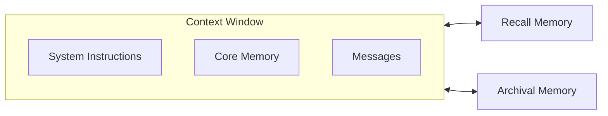
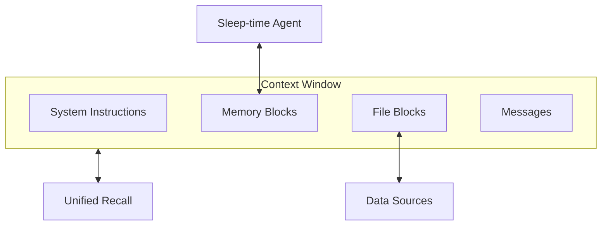

<Info>
Letta is made by the [creators of MemGPT](https://www.letta.com/about-us), and the default agent architecture in Letta is the official/original implementation of the MemGPT agent architecture.
</Info>

MemGPT agents solve the context window limitation of LLMs through context engineering across two tiers of memory: **in-context (core) memory** (including the system instructions, read-write memory blocks, and conversation history), and **out-of-context memory** (older evicted conversation history, and external memory stores).

To learn more about the origins of MemGPT, you can read the [MemGPT research paper](https://arxiv.org/abs/2310.08560), or take the free [LLM OS course](https://www.deeplearning.ai/short-courses/llms-as-operating-systems-agent-memory/?utm_campaign=memgpt-launch&utm_content=331638345&utm_medium=social&utm_source=docs&hss_channel=tw-992153930095251456) on DeepLearning.ai.

## MemGPT: the original LLM operating system



MemGPT agents are equipped with memory-editing tools that allow them to edit their in-context memory, and pull external data into the context window.

In Letta, the agent type `memgpt_agent` implements the original agent architecture from the MemGPT research paper, which includes a set of base tools:
* `send_message`: required for sending messages to the user
* `core_memory_append` and `core_memory_replace`: used for editing the contents of memory blocks in core memory (in-context memory)
* `conversation_search` for searching the conversation history ("recall storage" from the paper)
* `archival_memory_insert` and `archival_memory_search`: used for searching the archival memory (an external embedding-based memory store)

When the context window is full, the conversation history is compacted into a recursive summary (stored as a memory block).
In MemGPT all agent data is persisted indefinitely, and old message are still available via the `conversation_search` tool.

## Multi-step tool calling (heartbeats)

MemGPT agents are exclusively tool-calling agents - there is no native "chat" mode, which is why the `send_message` tool is required to send messages to the user (this makes is easy to have you agent "chat" with a user over multiple modalities, simply by adding various types of messaging tools to the agent).

MemGPT agents can execute multiple tool calls in sequence via the use of **heartbeats**: all tool calls have an additional `request_heartbeat` parameter, which when set to `true` will return execution back to the agent after the tool call returns. Additionally, if a tool call fails, a heartbeat is automatically requested to allow the agent to self-correct.

## Reasoning (thinking)

In MemGPT agents, reasoning (aka "thinking") is always exposed by the underlying LLM before the agent takes an action.
With standard models, reasoning is generated via an additional "thinking" field injected into the tool call arguments (similar to the heartbeat parameter).
For models that natively generate reasoning, MemGPT agents can be configured to use the native reasoning output of the model (note that certain model providers like OpenAI hide reasoning tokens from the developer).

## MemGPT v2: the latest iteration of MemGPT



The agent type `memgpt_v2_agent` implements the latest iteration of the MemGPT agent architecture, based on our latest research in [memory management](https://www.letta.com/blog/sleep-time-compute) and [model benchmarking](https://www.letta.com/blog/letta-leaderboard). We recommend using the v2 agent for most use cases.

**Key differences in v2:**
* [Sleep-time agent](/guides/agents/architectures/sleeptime) for background memory management
* [File-based tools](/guides/agents/sources) (`open_file`, `grep_file`, `search_file`) for memory editing
* Unified `recall` tool replaces conversation and archival memory tools
* `memory_insert` and `memory_replace`: used for editing the contents of memory blocks in core memory (in-context memory)
* `memory_rethink` and `memory_finish_edits`: for reorganizing and finalizing memory operations

## Creating MemGPT Agents

<CodeGroup>
```python title="Python"
from letta_client import Letta

client = Letta(token="LETTA_API_KEY")

agent_state = client.agents.create(
    agent_type="memgpt_v2_agent",  # or "memgpt_agent" for v1
    model="openai/gpt-4.1",
    embedding="openai/text-embedding-3-small",
    memory_blocks=[
        {
          "label": "human",
          "value": "The human's name is Chad. They like vibe coding."
        },
        {
          "label": "persona",
          "value": "My name is Sam, the all-knowing sentient AI."
        }
    ],
    tools=["web_search", "run_code"]
)
```

```typescript title="TypeScript"
import { LettaClient } from '@letta-ai/letta-client'

const client = new LettaClient({ token: "LETTA_API_KEY" });

const agentState = await client.agents.create({
    agentType: "memgpt_v2_agent",  // or "memgpt_agent" for v1
    model: "openai/gpt-4.1",
    embedding: "openai/text-embedding-3-small",
    memoryBlocks: [
        {
          label: "human",
          value: "The human's name is Chad. They like vibe coding."
        },
        {
          label: "persona",
          value: "My name is Sam, the all-knowing sentient AI."
        }
    ],
    tools: ["web_search", "run_code"]
});
```

```bash title="cURL"
curl -X POST https://api.letta.com/v1/agents \
     -H "Authorization: Bearer $LETTA_API_KEY" \
     -H "Content-Type: application/json" \
     -d '{
  "agent_type": "memgpt_v2_agent",
  "model": "openai/gpt-4.1",
  "embedding": "openai/text-embedding-3-small",
  "memory_blocks": [
    {
      "label": "human",
      "value": "The human'\''s name is Chad. They like vibe coding."
    },
    {
      "label": "persona",
      "value": "My name is Sam, the all-knowing sentient AI."
    }
  ],
  "tools": ["web_search", "run_code"]
}'
```
</CodeGroup>
