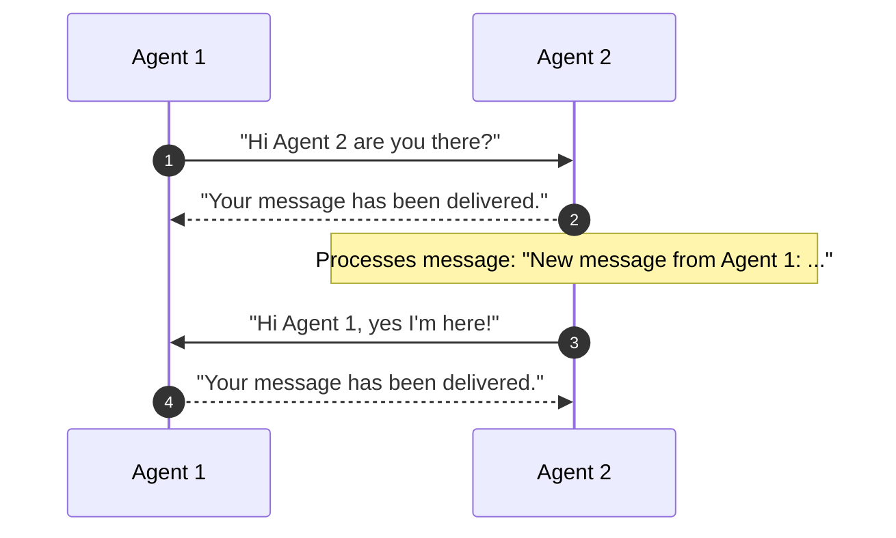
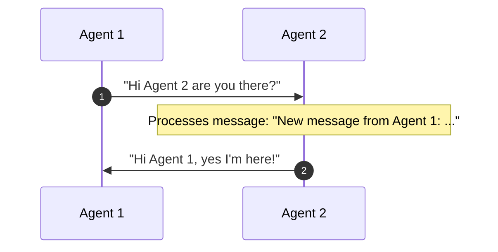
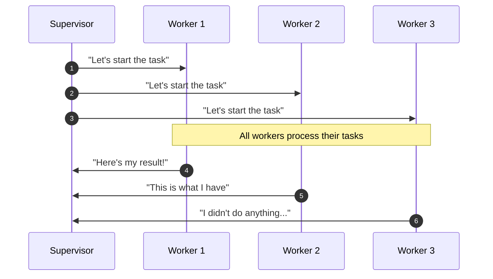

<Note icon="fa-sharp fa-solid fa-alien-8bit">
Check out a multi-agent tutorial [here](/cookbooks/multi-agent-async)!
</Note>
<Tip>
All agents in Letta are *stateful* - so when you build a multi-agent system in Letta, each agent can run both independently and with others via cross-agent messaging tools! The choice is yours.
</Tip>

Letta provides built-in tools for supporting cross-agent communication to build multi-agent systems.
To enable multi-agent collaboration, you should create agents that have access to the [built-in cross-agent communication tools](#built-in-multi-agent-tools) - either by attaching the tools in the ADE, or via the API or Python/TypeScript SDK.

Letta agents can also share state via [shared memory blocks](/guides/agents/multi-agent-shared-memory). Shared memory blocks allow agents to have shared memory (e.g. memory about an organization they are both a part of or a task they are both working on).

## Built-in Multi-Agent Tools
<Tip>
We recommend only attaching one of `send_message_to_agent_and_wait_for_reply` or `send_message_to_agent_async`, but not both.
Attaching both tools can cause the agent to become confused and use the tool less reliably.
</Tip>

Our built-in tools for multi-agent communication can be used to create both **synchronous** and **asynchronous** communication networks between agents on your Letta server.
However, because all agents in Letta are addressible via a REST API, you can also make your own custom tools that use the [API for messaging agents](/api-reference/agents/messages/create) to design your own version of agent-to-agent communication.

There are three built-in tools for cross-agent communication:
* `send_message_to_agent_async` for asynchronous multi-agent messaging,
* `send_message_to_agent_and_wait_for_reply` for synchronous multi-agent messaging,
* and `send_message_to_agents_matching_all_tags` for a "supervisor-worker" pattern

### Messaging another agent (async / no wait)
```python
# The function signature for the async multi-agent messaging tool
def send_message_to_agent_async(
    message: str,
    other_agent_id: str,
): -> str
```


The `send_message_to_agent_async` tool allows one agent to send a message to another agent.
This tool is **asynchronous**: instead of waiting for a response from the target agent, the agent will return immediately after sending the message.
The message that is sent to the target agent contains a "message receipt", indicating which agent sent the message, which allows the target agent to reply to the sender (assuming they also have access to the `send_message_to_agent_async` tool).

### Messaging another agent (wait for reply)
```python
# The function signature for the synchronous multi-agent messaging tool
def send_message_to_agent_and_wait_for_reply(
    message: str,
    other_agent_id: str,
): -> str
```


The `send_message_to_agent_and_wait_for_reply` tool also allows one agent to send a message to another agent.
However, this tool is **synchronous**: the agent will wait for a response from the target agent before returning.
The response of the target agent is returned in the tool output - if the target agent does not respond, the tool will return default message indicating no response was received.

### Messaging a group of agents (supervisor-worker pattern)
```python
# The function signature for the group broadcast multi-agent messaging tool
def send_message_to_agents_matching_all_tags(
    message: str,
    tags: List[str],
) -> List[str]:
```


The `send_message_to_agents_matching_all_tags` tool allows one agent to send a message a larger group of agents in a "supervisor-worker" pattern.
For example, a supervisor agent can use this tool to send a message asking all workers in a group to begin a task.
This tool is also **synchronous**, so the result of the tool call will be a list of the responses from each agent in the group.
