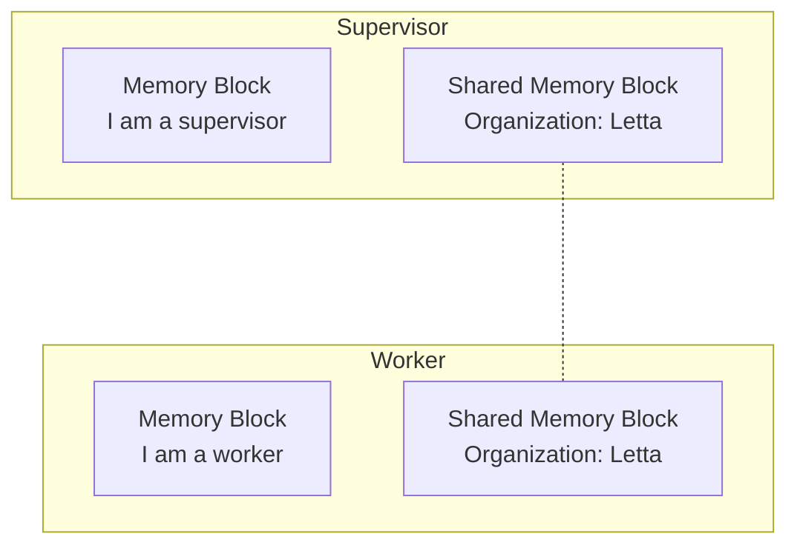

Agents can share state via shared memory blocks.
This allows agents to have a "shared memory".
You can shared blocks between agents by attaching the same block ID to multiple agents.



In the example code below, we create a shared memory block and attach it to a supervisor agent and a worker agent.
Because the memory block is shared, when one agent writes to it, the other agent can read the updates immediately.

<CodeGroup>
```python title="python" maxLines=50
# install letta_client with `pip install letta-client`
from letta_client import Letta

# create a client to connect to Letta
client = Letta(token="LETTA_API_KEY")

# create a shared memory block
shared_block = client.blocks.create(
    label="organization",
    description="Shared information between all agents within the organization.",
    value="Nothing here yet, we should update this over time."
)

# create a supervisor agent
supervisor_agent = client.agents.create(
    model="anthropic/claude-3-5-sonnet-20241022",
    embedding="openai/text-embedding-3-small",
    # blocks created for this agent
    memory_blocks=[{"label": "persona", "value": "I am a supervisor"}],
    # pre-existing shared block that is "attached" to this agent
    block_ids=[shared_block.id],
)

# create a worker agent
worker_agent = client.agents.create(
    model="anthropic/claude-3-5-sonnet-20241022",
    embedding="openai/text-embedding-3-small",
    # blocks created for this agent
    memory_blocks=[{"label": "persona", "value": "I am a worker"}],
    # pre-existing shared block that is "attached" to this agent
    block_ids=[shared_block.id],
)
```
```typescript title="node.js" maxLines=50
// install letta-client with `npm install @letta-ai/letta-client`
import { LettaClient } from '@letta-ai/letta-client'

// create a client to connect to Letta
const client = new LettaClient({
    token: "LETTA_API_KEY"
});

// create a shared memory block
const sharedBlock = await client.blocks.create({
    label: "organization",
    description: "Shared information between all agents within the organization.",
    value: "Nothing here yet, we should update this over time."
});

// create a supervisor agent
const supervisorAgent = await client.agents.create({
    model: "anthropic/claude-3-5-sonnet-20241022",
    embedding: "openai/text-embedding-3-small",
    // blocks created for this agent
    memoryBlocks: [{ label: "persona", value: "I am a supervisor" }],
    // pre-existing shared block that is "attached" to this agent
    blockIds: [sharedBlock.id]
});

// create a worker agent
const workerAgent = await client.agents.create({
    model: "anthropic/claude-3-5-sonnet-20241022",
    embedding: "openai/text-embedding-3-small",
    // blocks created for this agent
    memoryBlocks: [{ label: "persona", value: "I am a worker" }],
    // pre-existing shared block that is "attached" to this agent
    blockIds: [sharedBlock.id]
});
```
</CodeGroup>

Memory blocks can also be accessed by other agents, even if not shared.
For example, worker agents can write the output of their task to a memory block, which is then read by a supervisor agent.
To access the memory blocks of other agents, you can simply use the SDK clients or API to access specific agent's memory blocks (using the [core memory routes](/api-reference/agents/core-memory)).
