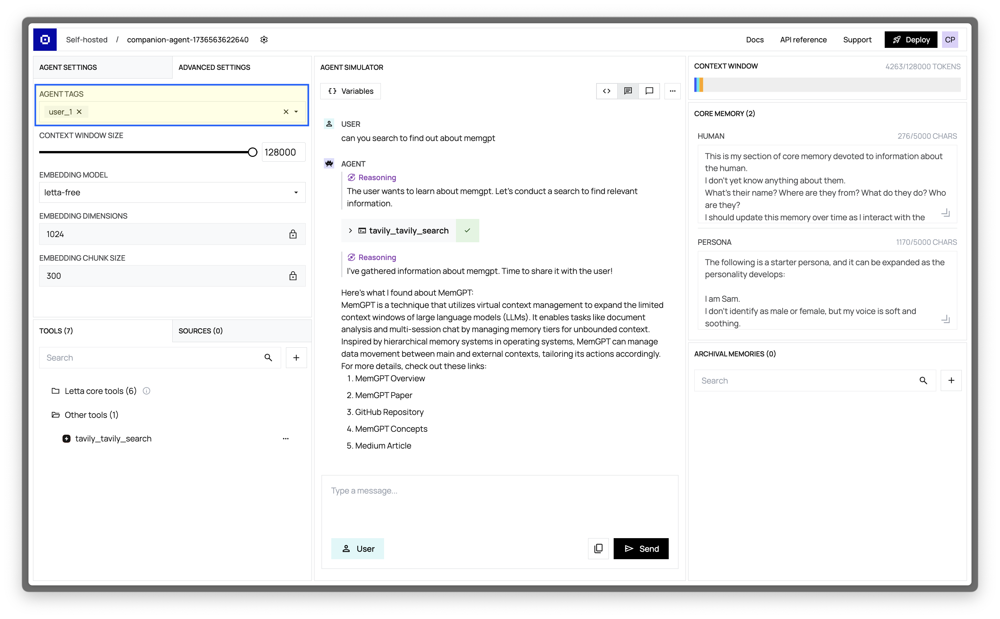

You may be building a multi-user application with Letta, in which each user is associated with a specific agent.
In this scenario, you can use **Identities** to associate each agent with a user in your application.

## Using Identities
Let's assume that you have an application with multiple users that you're building on a [self-hosted Letta server](/guides/server/docker) or [Letta Cloud](/guides/cloud).
Each user has a unique username, starting at `user_1`, and incrementing up as you add more users to the platform.

To associate agents you create in Letta with your users, you can first create an **Identity** object with the user's unique ID as the `identifier_key` for your user, and then specify the **Identity** object ID when creating an agent.

For example, with `user_1`, we would create a new Identity object with `identifier_key="user_1"` and then pass `identity.id` into our [create agent request](/api-reference/agents/create):
<CodeBlocks>
```curl title="curl"
curl -X POST https://app.letta.com/v1/identities/ \
     -H "Authorization: Bearer <token>" \
     -H "Content-Type: application/json" \
     -d '{
  "identifier_key": "user_1",
  "name": "Caren",
  "identity_type": "user"
}'
{"id":"identity-634d3994-5d6c-46e9-b56b-56e34fe34ca0","identifier_key":"user_1","name":"Caren","identity_type":"user","project_id":null,"agent_ids":[],"organization_id":"org-00000000-0000-4000-8000-000000000000","properties":[]}
curl -X POST https://app.letta.com/v1/agents/ \
     -H "Authorization: Bearer <token>" \
     -H "Content-Type: application/json" \
     -d '{
  "memory_blocks": [],
  "llm": "anthropic/claude-3-5-sonnet-20241022",
  "context_window_limit": 200000,
  "embedding": "openai/text-embedding-3-small",
  "identity_ids": ["identity-634d3994-5d6c-46e9-b56b-56e34fe34ca0"]
}'
```
```python title="python"
# assumes that you already instantiated a client
identity = client.identities.create(
    identifier_key="user_1",
    name="Caren",
    identity_type="user"
)
agent = client.agents.create(
    memory_blocks=[],
    model="anthropic/claude-3-5-sonnet-20241022",
    context_window_limit=200000,
    embedding="openai/text-embedding-3-small",
    identity_ids=[identity.id]
)
```

```typescript title="node.js"
// assumes that you already instantiated a client
const identity = await client.identities.create({
    identifierKey: "user_1",
    name: "Caren",
    identityType: "user"
})
const agent = await client.agents.create({
    memoryBlocks: [],
    model: "anthropic/claude-3-5-sonnet-20241022",
    contextWindowLimit: 200000,
    embedding: "openai/text-embedding-3-small",
    identityIds: [identity.id]
});
```
</CodeBlocks>

Then, if I wanted to search for agents associated with a specific user (e.g. called `user_id`), I could use the `identifier_keys` parameter in the [list agents request](/api-reference/agents/list):
<CodeBlocks>
```curl title="curl"
curl -X GET "https://app.letta.com/v1/agents/?identifier_keys=user_1" \
  -H "Accept: application/json"
```
```python title="python"
# assumes that you already instantiated a client
user_agents = client.agents.list(
    identifier_keys=["user_1"]
)
```
```typescript title="node.js"
// assumes that you already instantiated a client
await client.agents.list({
    identifierKeys: ["user_1"]
});
```
</CodeBlocks>

You can also create an identity object and attach it to an existing agent. This can be useful if you want to enable multiple users to interact with a single agent:
<CodeBlocks>
```curl title="curl"
curl -X POST https://app.letta.com/v1/identities/ \
     -H "Authorization: Bearer <token>" \
     -H "Content-Type: application/json" \
     -d '{
  "identifier_key": "user_1",
  "name": "Sarah",
  "identity_type": "user"
  "agent_ids": ["agent-00000000-0000-4000-8000-000000000000"]
}'
```
```python title="python"
# assumes that you already instantiated a client
identity = client.identities.create({
    identifier_key="user_1",
    name="Sarah",
    identity_type="user"
    agent_ids=["agent-00000000-0000-4000-8000-000000000000"]
})
```
```typescript title="node.js"
// assumes that you already instantiated a client
const identity = await client.identities.create({
    identifierKey: "user_1",
    name: "Sarah",
    identityType: "user"
    agentIds: ["agent-00000000-0000-4000-8000-000000000000"]
})
```
</CodeBlocks>

### Using Agent Tags to Identify Users
It's also possible to utilize our agent tags feature to associate agents with specific users. To associate agents you create in Letta with your users, you can specify a tag when creating an agent, and set the tag to the user’s unique ID.
This example assumes that you have a self-hosted Letta server running on localhost (for example, by running [`docker run ...`](/guides/server/docker)).
<Accordion title="View example Python SDK code">
```python title="python"
from letta_client import Letta

# in this example we'll connect to a self-hosted Letta server
client = Letta(base_url="http://localhost:8283")
user_id = "my_uuid"

# create an agent with the user_id tag
agent = client.agents.create(
    memory_blocks=[],
    model="anthropic/claude-3-5-sonnet-20241022",
    context_window_limit=200000,
    embedding="openai/text-embedding-3-small",
    tags=[user_id]
)
print(f"Created agent with id {agent.id}, tags {agent.tags}")

# list agents
user_agents = client.agents.list(tags=[user_id])
agent_ids = [agent.id for agent in user_agents]
print(f"Found matching agents {agent_ids}")
```
</Accordion>

## Creating and Viewing Tags in the ADE
You can also modify tags in the ADE.
Simply click the **Advanced Settings** tab in the top-left of the ADE to view an agent's tags.
You can create new tags by typing the tag name in the input field and hitting enter.

