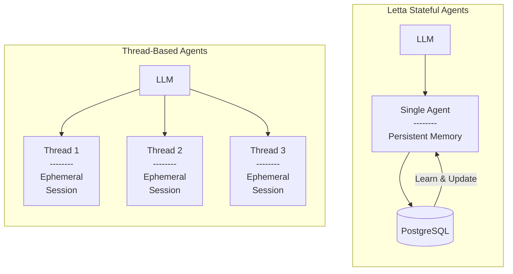

Letta agents can automatically manage long-term memory, load data from external sources, and call custom tools.
Unlike in other frameworks, Letta agents are stateful, so they keep track of historical interactions and reserve part of their context to read and write memories which evolve over time.


Letta manages a reasoning loop for agents. At each agent step (i.e. iteration of the loop), the state of the agent is checkpointed and persisted to the database.

You can interact with agents from a REST API, the ADE, and TypeScript / Python SDKs.
As long as they are connected to the same service, all of these interfaces can be used to interact with the same agents.

<Tip>
If you're interested in learning more about stateful agents, read our [blog post](https://www.letta.com/blog/stateful-agents).
</Tip>

## Agents vs Threads

In Letta, you can think of an agent as a single entity that has a single message history which is treated as infinite.
The sequence of interactions the agent has experienced through its existence make up the agent's state (or memory).

One distinction between Letta and other agent frameworks is that Letta does not have the notion of message *threads* (or *sessions*).
Instead, there are only *stateful agents*, which have a single perpetual thread (sequence of messages).

The reason we use the term *agent* rather than *thread* is because Letta is based on the principle that **all agents interactions should be part of the persistent memory**, as opposed to building agent applications around ephemeral, short-lived interactions (like a thread or session).


If you would like to create common starting points for new conversation "threads", we recommending using [agent templates](/guides/templates/overview) to create new agents for each conversation, or directly copying agent state from an existing agent.

For multi-users applications, we recommend creating an agent per-user, though you can also have multiple users message a single agent (but it will be a single shared message history).

## Create an agent
<Note>
To start creating agents, you can run a Letta server locally using **Letta Desktop**, deploy a server locally + remotely with **Docker**, or use **Letta Cloud**. See our [quickstart guide](/quickstart) for more information.
</Note>

Assuming we're running a Letta server locally at `http://localhost:8283`, we can create a new agent via the REST API, Python SDK, or TypeScript SDK:
<CodeGroup>
```curl curl
curl -X POST http://localhost:8283/v1/agents/ \
     -H "Content-Type: application/json" \
     -d '{
  "memory_blocks": [
    {
      "value": "The human'\''s name is Bob the Builder.",
      "label": "human"
    },
    {
      "value": "My name is Sam, the all-knowing sentient AI.",
      "label": "persona"
    }
  ],
  "model": "openai/gpt-4o-mini",
  "context_window_limit": 16000,
  "embedding": "openai/text-embedding-3-small"
}'
```
```python title="python" maxLines=50
# install letta_client with `pip install letta-client`
from letta_client import Letta

# create a client to connect to your local Letta server
client = Letta(
  base_url="http://localhost:8283"
)

# create an agent with two basic self-editing memory blocks
agent_state = client.agents.create(
    memory_blocks=[
        {
          "label": "human",
          "value": "The human's name is Bob the Builder."
        },
        {
          "label": "persona",
          "value": "My name is Sam, the all-knowing sentient AI."
        }
    ],
    model="openai/gpt-4o-mini",
    context_window_limit=16000,
    embedding="openai/text-embedding-3-small"
)

# the AgentState object contains all the information about the agent
print(agent_state)
```
```typescript maxLines=50 title="node.js"
// install letta-client with `npm install @letta-ai/letta-client`
import { LettaClient } from '@letta-ai/letta-client'

// create a client to connect to your local Letta server
const client = new LettaClient({
  baseUrl: "http://localhost:8283"
});

// create an agent with two basic self-editing memory blocks
const agentState = await client.agents.create({
    memoryBlocks: [
        {
          label: "human",
          value: "The human's name is Bob the Builder."
        },
        {
          label: "persona",
          value: "My name is Sam, the all-knowing sentient AI."
        }
    ],
    model: "openai/gpt-4o-mini",
    contextWindowLimit: 16000,
    embedding: "openai/text-embedding-3-small"
});

// the AgentState object contains all the information about the agent
console.log(agentState);
```
</CodeGroup>
You can also create an agent without any code using the [Agent Development Environment (ADE)](/agent-development-environment).
All Letta agents are stored in a database on the Letta server, so you can access the same agents from the ADE, the REST API, the Python SDK, and the TypeScript SDK.

The response will include information about the agent, including its `id`:
```json
{
  "id": "agent-43f8e098-1021-4545-9395-446f788d7389",
  "name": "GracefulFirefly",
  ...
}
```

Once an agent is created, you can message it:
<CodeGroup>
```curl curl
curl --request POST \
  --url http://localhost:8283/v1/agents/$AGENT_ID/messages \
  --header 'Content-Type: application/json' \
  --data '{
  "messages": [
    {
      "role": "user",
      "content": "hows it going????"
    }
  ]
}'
```
```python title="python" maxLines=50
# send a message to the agent
response = client.agents.messages.create(
    agent_id=agent_state.id,
    messages=[
        {
            "role": "user",
            "content": "hows it going????"
        }
    ]
)

# the response object contains the messages and usage statistics
print(response)

# if we want to print the usage stats
print(response.usage)

# if we want to print the messages
for message in response.messages:
    print(message)
```
```typescript maxLines=50 title="node.js"
// send a message to the agent
const response = await client.agents.messages.create(
    agentState.id, {
        messages: [
            {
                role: "user",
                content: "hows it going????"
            }
        ]
    }
);

// the response object contains the messages and usage statistics
console.log(response);

// if we want to print the usage stats
console.log(response.usage)

// if we want to print the messages
for (const message of response.messages) {
    console.log(message);
}
```
</CodeGroup>

### Message Types
The `response` object contains the following attributes:
* `usage`: The usage of the agent after the message was sent (the prompt tokens, completition tokens, and total tokens)
* `message`: A list of `LettaMessage` objects, generated by the agent

#### `LettaMessage`
The `LettaMessage` object is a simplified version of the `Message` object stored in the database backend.
Since a `Message` can include multiple events like a chain-of-thought and function calls, `LettaMessage` simplifies messages to have the following types:
* `reasoning_message`: The inner monologue (chain-of-thought) of the agent
* `tool_call_message`: An agent's tool (function) call
* `tool_call_return`: The result of executing an agent's tool (function) call
* `assistant_message`: An agent calling the `send_message` tool to communicate with the user
* `system_message`: A system message (for example, an alert about the user logging in)
* `user_message`: A user message

The `assistant_message` message type is a convenience wrapper around the `tool_call_message` when the tool call is the predefined `send_message` tool that makes it easier to parse agent messages.
If you prefer to see the raw tool call even in the `send_message` case, you can set `use_assistant_message` to `false` in the request `config` (see the [endpoint documentation](/api-reference/agents/messages/create)).

## Common agent operations
For more in-depth guide on the full set of Letta agent operations, check out our [API reference](/api-reference/overview), our extended [Python SDK](https://github.com/letta-ai/letta/blob/main/examples/docs/example.py) and [TypeScript SDK](https://github.com/letta-ai/letta/blob/main/examples/docs/node/example.ts) examples, as well as our other [cookbooks](/cookbooks).

If you're using a self-hosted Letta server, you should set the **base URL** (`base_url` in Python, `baseUrl` in TypeScript) to the Letta server's URL (e.g. `http://localhost:8283`) when you create your client. See an example [here](/api-reference/overview).

If you're using a self-hosted server, you can omit the token if you're not using [password protection](/guides/server/docker#password-protection-advanced).
If you are using password protection, set your **token** to the **password**.
If you're using Letta Cloud, you should set the **token** to your **Letta Cloud API key**.

### Retrieving an agent's state
The agent's state is always persisted, so you can retrieve an agent's state by its ID.
<EndpointRequestSnippet endpoint="GET /v1/agents/:agent_id" />

The result of the call is an `AgentState` object:
<EndpointResponseSnippet endpoint="GET /v1/agents/:agent_id" />

### List agents
Replace `agent_id` with your actual agent ID.
<EndpointRequestSnippet endpoint="GET /v1/agents/" />

The result of the call is a list of `AgentState` objects:
<EndpointResponseSnippet endpoint="GET /v1/agents/" />

### Delete an agent
To delete an agent, you can use the `DELETE` endpoint with your `agent_id`:
<EndpointRequestSnippet endpoint="DELETE /v1/agents/:agent_id" />
