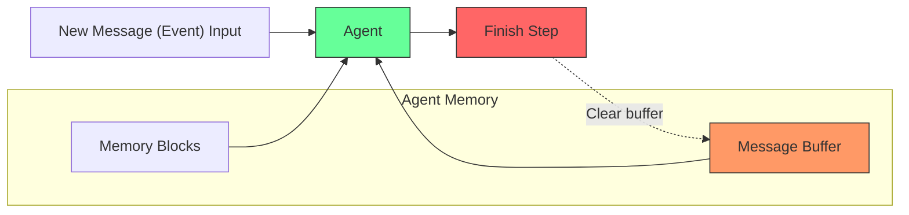

In some advanced usecases, you may want your agent to have persistent memory while not retaining conversation history.
For example, if you are using a Letta agent as a "workflow" that's run many times across many different users, you may not want to keep the conversation or event history inside of the message buffer.

You can create a stateful agent that does not retain conversation (event) history (i.e. a "stateful workflow") by setting the `message_buffer_autoclear` flag to `true` during [agent creation](/api-reference/agents/create). If set to `true` (default `false`), the message history will not be persisted in-context between requests (though the agent will still have access to in-context memory blocks).

