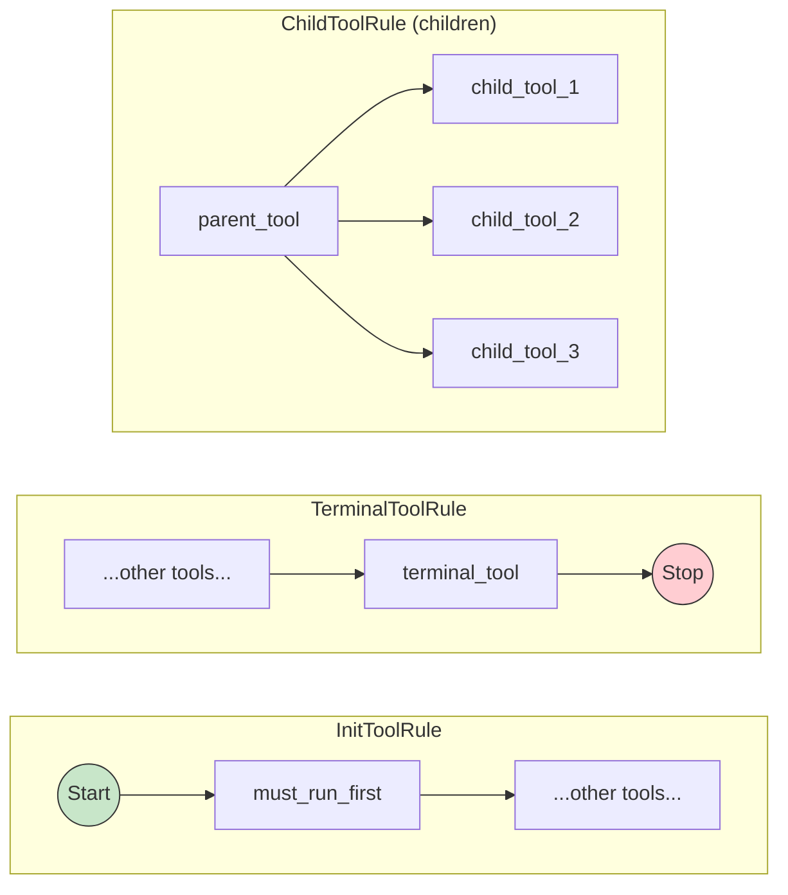

Tool rules allows developer to define constrains on their tools, such as requiring that a tool terminate agent execution or be followed by another tool.

<Frame>

</Frame>

Letta currently supports the following tool rules (with more being added):

* `TerminalToolRule(tool_name=...)`
  * If the tool is called, the agent ends execution
* `InitToolRule(tool_name=...)`
  * The tool must be called first when an agent is run
* `ChildToolRule(tool_name=..., children=[...])`
  * If the tool is called, it must be followed by one of the tools specified in `children`
* `ParentToolRule(tool_name=..., children=[...])`
  * The tool must be called before the tools specified in `children` can be called
* `ConditionalToolRule(tool_name=..., child_output_mapping={...})`
  * If the tool is called, it must be followed by one of the tools specified in `children` based off the tool's output
* `ContinueToolRule(tool_name=...)`
  * If the tool is called, the agent must continue execution
* `MaxCountPerStepToolRule(tool_name=..., max_count_limit=...)`
  * The tool cannot be called more than `max_count_limit` times in a single step

## Default tool rules

By default, the `send_message` tool is marked with `TerminalToolRule`, since you usually do not want the agent to continue executing after it has sent a message to the user.

Depending on your chosen [agent architecture](/guides/agents/architectures), there may be other default tool rules applied to improve the performance of your agent.

## Tool rule examples

For example, you can ensure that the agent will stop execution if either the `send_message` or `roll_d20` tool is called by specifying tool rules in the agent creation:
```python title="python" {6-11}
# create a new agent
agent_state = client.create_agent(
    # create the agent with an additional tool
    tools=[tool.name],
    # add tool rules that terminate execution after specific tools
    tool_rules=[
        # exit after roll_d20 is called
        TerminalToolRule(tool_name=tool.name, type="exit_loop"),
        # exit after send_message is called (default behavior)
        TerminalToolRule(tool_name="send_message", type="exit_loop"),
    ],
)

print(f"Created agent with name {agent_state.name} with tools {agent_state.tools}")
```

You can see a full working example of tool rules [here](https://github.com/letta-ai/letta/blob/0.5.2/examples/tool_rule_usage.py).
