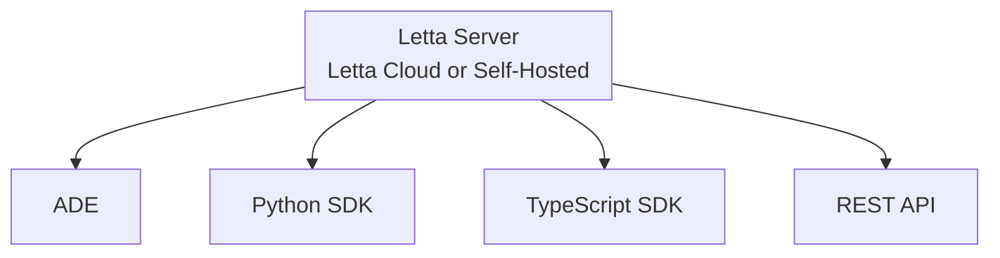

The Letta platform provides multiple ways to interact with your stateful agents. Whether through the ADE's visual interface or programmatically via our APIs, you're always connecting to the same agents running in your Letta server.



## APIs and SDKs

We provide a comprehensive REST API and native SDKs in Python and TypeScript. All three interfaces - the ADE, REST API, and SDKs - use the same underlying API to interact with your agents, making it seamless to develop visually in the ADE and then integrate those agents into your applications.

### Python SDK

<Note>
The legacy Letta Python `LocalClient`/`RestClient` SDK is available under `pip install letta` (which also contains the server).
This client is deprecated and will be replaced in a future release with the new `letta-client`.
Please migrate any Python code using the old `RESTClient` or `LocalClient` to use `letta-client` to avoid breaking changes in the future.
</Note>

The Letta [Python SDK](https://github.com/letta-ai/letta-python) can be downloaded with:
```bash
pip install letta-client
```

Once installed, you can instantiate the client in your Python code with:
```python
from letta_client import Letta

# connect to a local server
client = Letta(base_url="http://localhost:8283")

# connect to Letta Cloud
client = Letta(
    token="LETTA_API_KEY",
    project="default-project",
)
```

### TypeScript SDK
The Letta [TypeScript (Node) SDK](https://github.com/letta-ai/letta-node) can be downloaded with:
```bash
npm install @letta-ai/letta-client
```

Once installed, you can instantiate the client in your TypeScript code with:
```typescript
import { LettaClient } from '@letta-ai/letta-client'

// connect to a local server
const client = new LettaClient({
    baseUrl: "http://localhost:8283",
});

// connect to Letta Cloud
const client = new LettaClient({
    token: "LETTA_API_KEY",
    project: "default-project",
});

```
