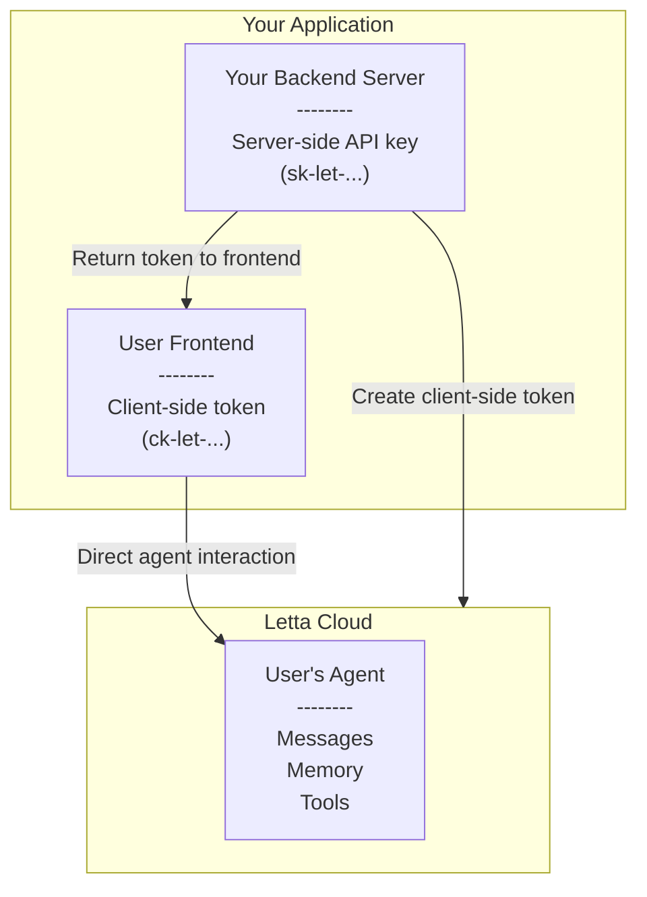

<Note>
Client-side access tokens are a feature in [Letta Cloud](/guides/cloud) that allow you to build user-facing apps where your end users can directly interact with their own agents without exposing your Letta Cloud API keys.
</Note>

Client-side access tokens enable direct client integration without requiring a server proxy. Your end users can authenticate securely and interact with their agents directly from your frontend application.

With client-side access tokens, you can provide secure user authentication where users authenticate directly with their own tokens. This enables direct client integration without the need for server-side proxy endpoints, while maintaining granular permissions per user and enhanced security through auto-expiring tokens.

<Frame>

</Frame>

## Creating client-side access tokens

<CodeGroup>
```python title="python" maxLines=50
from letta_client import Letta

# Initialize the client
client = Letta(token="YOUR_TOKEN", project="YOUR_PROJECT")

# Create the token
client.client_side_access_tokens.create(
    policy=[
        {
            "type": "agent",
            "id": "id",
            "access": ["read_messages"],
        }
    ],
    hostname="hostname",
)
```
```typescript title="node.js" maxLines=50
import { LettaClient } from "@letta-ai/letta-client";

// Initialize the client
const client = new LettaClient({
  token: "YOUR_TOKEN",
  project: "YOUR_PROJECT",
});

// Create the token
await client.clientSideAccessTokens.create({
  policy: [
    {
      type: "agent",
      id: "id",
      access: ["read_messages"],
    },
  ],
  hostname: "hostname",
});
```
</CodeGroup>

## Token policy configuration

When creating client-side access tokens, you configure granular permissions through the `policy` parameter.

### Policy structure

Each policy entry consists of a `type` (currently supports "agent"), an `id` for the specific resource, and an `access` array containing the permissions for that resource.

### Available permissions

For agent resources, you can grant `read_messages` permission to read agent messages, `write_messages` permission to send messages to the agent, `read_agent` permission to read agent metadata and configuration, and `write_agent` permission to update agent metadata and configuration.

## Token expiration

<Note>
Client-side access tokens automatically expire for enhanced security. The default expiration is 5 minutes if not specified.
</Note>

You can specify a custom expiration time using the `expires_at` parameter:

<CodeGroup>
```python title="python" maxLines=50
client = Letta(token="YOUR_TOKEN", project="YOUR_PROJECT")
client_token = client.client_side_access_tokens.create(
    policy=[/* ... */],
    hostname="https://your-app.com",
    expires_at="2024-12-31T23:59:59Z",  # Optional, ISO 8601 format
)
```
```typescript title="node.js" maxLines=50
const clientToken = await client.clientSideAccessTokens.create({
  policy: [/* ... */],
  hostname: "https://your-app.com",
  expires_at: "2024-12-31T23:59:59Z", // Optional, ISO 8601 format
});
```
</CodeGroup>

## Security considerations

When implementing client-side access tokens, it's important to follow security best practices. Tokens are automatically bound to the specified hostname to prevent unauthorized use, but this security feature can be easily bypassed, it merely exists to prevent accidental usage in wrong hostnames. Hackers can always spoof request headers. You should grant only the minimum permissions required for your use case, following the principle of least privilege. Additionally, regularly create new tokens and delete old ones to maintain security, and store tokens securely in your client application using appropriate browser APIs.

## Deleting tokens

You can delete client-side access tokens when they're no longer needed:

<CodeGroup>
```python title="python" maxLines=50
client = Letta(token="YOUR_TOKEN", project="YOUR_PROJECT")
client.client_side_access_tokens.delete("ck-let-token-value")
```
```typescript title="node.js" maxLines=50
await client.clientSideAccessTokens.delete("ck-let-token-value");
```
</CodeGroup>

## Example use case: multi-user chat application

Here's how you might implement client-side access tokens in a multi-user chat application:

<CodeGroup>
```python title="python" maxLines=50
# Server-side: Create user-specific tokens when users log in
def create_user_token(user_id: str, agent_id: str):
    client_token = client.client_side_access_tokens.create(
        policy=[
            {
                "type": "agent",
                "id": agent_id,
                "access": ["read_messages", "write_messages"],
            }
        ],
        hostname="https://chat.yourapp.com",
        expires_at=(datetime.now() + timedelta(hours=24)).isoformat(),  # 24 hours
    )
    return client_token.token

# Client-side: Use the token to communicate directly with the agent
user_client = Letta(token=user_token, project="YOUR_PROJECT")  # Received from your backend

# Send messages directly to the agent
response = user_client.agents.messages.create(
    agent_id=agent_id,
    messages=[
        {
            "role": "user",
            "content": "Hello, agent!",
        }
    ],
)
```
```typescript title="node.js" maxLines=50
// Server-side: Create user-specific tokens when users log in
async function createUserToken(userId: string, agentId: string) {
  const clientToken = await client.clientSideAccessTokens.create({
    policy: [
      {
        type: "agent",
        id: agentId,
        access: ["read_messages", "write_messages"],
      },
    ],
    hostname: "https://chat.yourapp.com",
    expires_at: new Date(Date.now() + 24 * 60 * 60 * 1000).toISOString(), // 24 hours
  });

  return clientToken.token;
}

// Client-side: Use the token to communicate directly with the agent
const userClient = new LettaClient({
  token: userToken, // Received from your backend
  project: "YOUR_PROJECT",
});

// Send messages directly to the agent
const response = await userClient.agents.messages.create(agentId, {
  messages: [
    {
      role: "user",
      content: "Hello, agent!",
    },
  ],
});
```
</CodeGroup>

This approach eliminates the need for server-side API proxying while maintaining secure, isolated access for each user.
