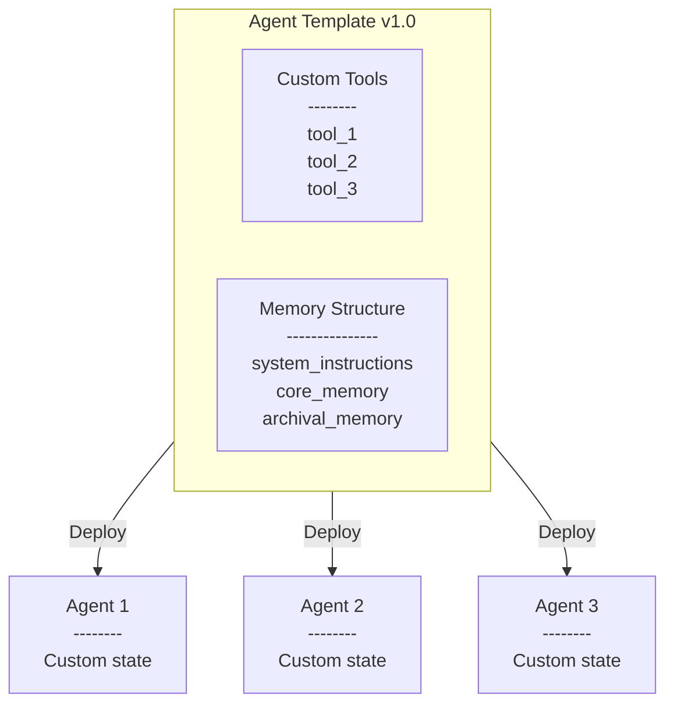
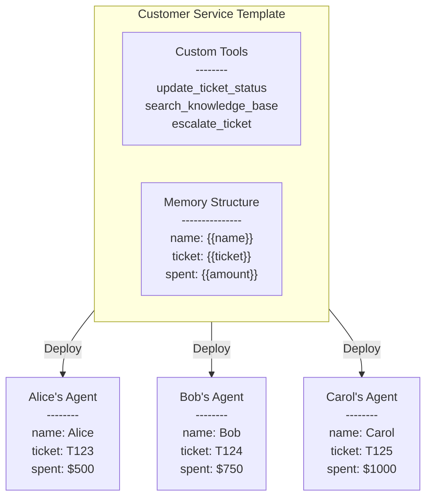

<Tip>
Agent Templates are a feature in [Letta Cloud](/guides/cloud) that allow you to quickly spawn new agents from a common agent design.
</Tip>

Agent templates allow you to create a common starting point (or *template*) for your agents.
You can define the structure of your agent (its tools and memory) in a template,
then easily create new agents off of that template.

<Frame>

</Frame>

Agent templates support [versioning](/guides/templates/versioning), which allows you to programatically
upgrade all agents on an old version of a template to the new version of the same template.

Agent templates also support [memory variables](/guides/templates/variables), a way to conveniently customize
sections of memory at time of agent creation (when the template is used to create a new agent).

## Agents vs Agent Templates

**Templates** define a common starting point for your **agents**, but they are not agents themselves.
When you are editing a template in the ADE, the ADE will simulate an agent for you
(to help you debug and design your template), but the simulated agent in the simulator is not retained.

You can refresh the simulator and create a new simulated agent from your template at any time by clicking the "Flush Simulation" button 🔄 (at the top of the chat window).

To create a persistent agent from an existing template, you can use the  [create agents from template endpoint](/api-reference/templates/agents/create):
```sh
curl -X POST https://app.letta.com/v1/templates/{project_slug}/{template_name}:{template_version} \
  -H 'Content-Type: application/json' \
  -H 'Authorization: Bearer YOUR_API_KEY' \
  -d '{}'
```

### Creating a template from an agent
You may have started with an agent and later decide that you'd like to convert it into a template to allow you to easily create new copies of your agent.

To convert an agent (deployed on Letta Cloud) into a template, simply open the agent in the ADE and click the "Convert to Template" button.

## Example usecase: customer service
Imagine you're creating a customer service chatbot application.
You may want every user that starts a chat sesion to get their own personalized agent:
the agent should know things specific to each user, like their purchase history, membership status, and so on.

<Frame>

</Frame>

However, despite being custom to individual users, each agent may share a common structure:
all agents may have access to the same tools, and the general strucutre of their memory may look the same.
For example, all customer service agents may have the `update_ticket_status` tool that allows the agent to update the status of a support ticket in your backend service.
Additionally, the agents may share a common structure to their memory block storing user information.

This is the perfect scenario to use an **agent template**!

You can take advantage of memory variables to write our user memory (one of our core memory blocks) to exploit the common structure across all users:
```handlebars
The user is contacting me to resolve a customer support issue.
Their name is {{name}} and the ticket number for this request is {{ticket}}.
They have spent ${{amount}} on the platform.
If they have spent over $700, they are a gold customer.
Gold customers get free returns and priority shipping.
```

Notice how the memory block uses variables (wrapped in `{{ }}`) to specify what part of the memory should be defined at agent creation time, vs within the template itself.
When we create an agent using this template, we can specify the values to use in place of the variables.
