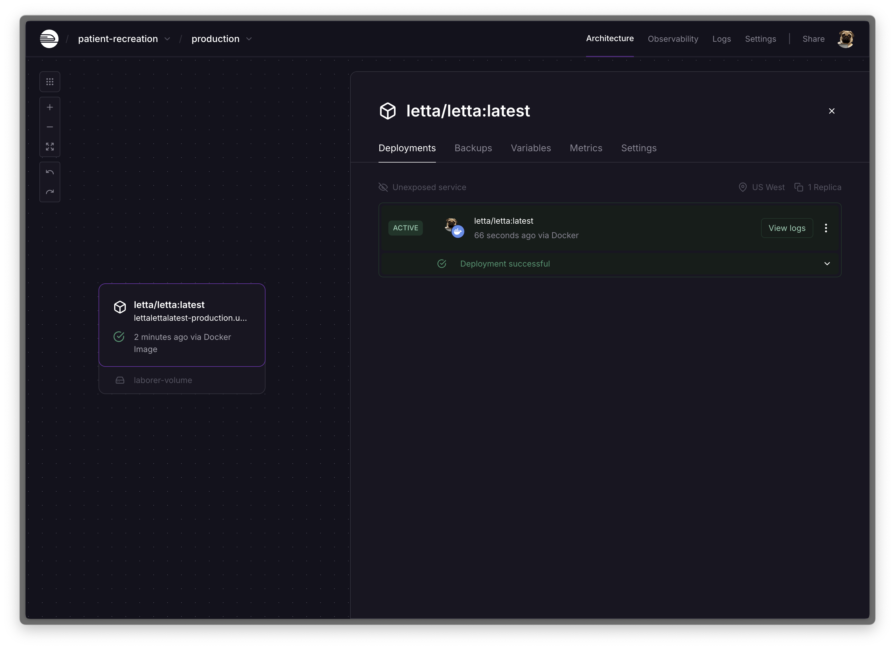
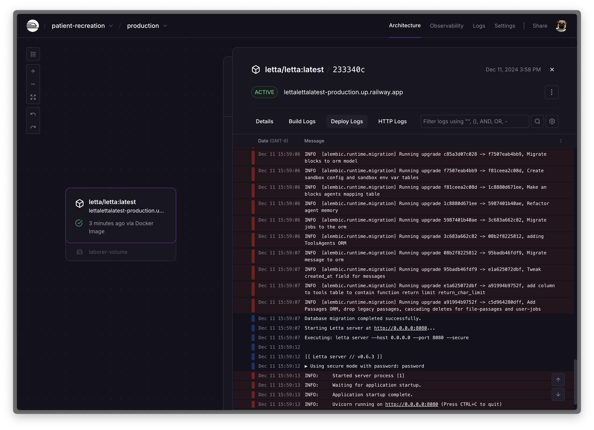
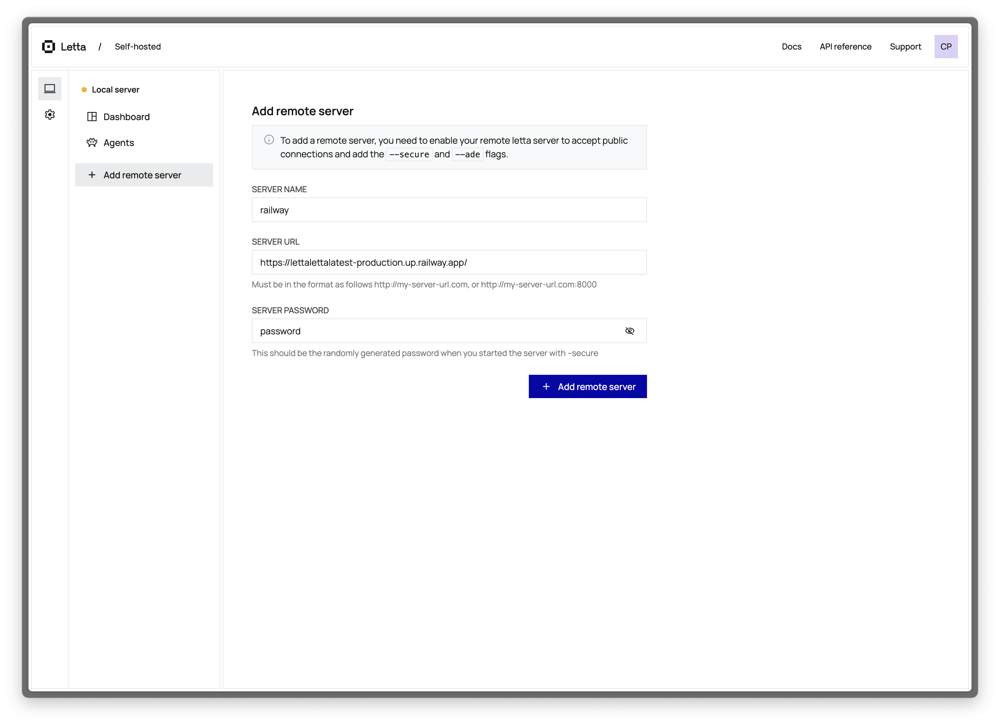

<Tip>[Railway](https://railway.app) is a service that allows you to easily deploy services (such as Docker containers) to the cloud. The following example uses Railway, but the same general principles around deploying the Letta Docker image on a cloud service and connecting it to the ADE) are generally applicable to other cloud services beyond Railway.</Tip>

## Deploying the Letta Railway template

We've prepared a Letta Railway template that has the necessary environment variables set and mounts a persistent volume for database storage.
You can access the template by clicking the "Deploy on Railway" button below:

[](https://railway.app/template/jgUR1t?referralCode=kdR8zc)

<Frame caption="The deployment screen will give you the opportunity to specify some basic environment variables such as your OpenAI API key. You can also specify these after deployment in the variables section in the Railway viewer.">
  
</Frame>

<Frame caption="If the deployment is successful, it will be shown as 'Active', and you can click 'View logs'.">
  
</Frame>

<Frame caption="Clicking 'View logs' will reveal the static IP address of the deployment (ending in 'railway.app').">
  
</Frame>

## Accessing the deployment via the ADE

Now that the Railway deployment is active, all we need to do to access it via the ADE is add it to as a new remote Letta server.
The default password set in the template is `password`, which can be changed at the deployment stage or afterwards in the 'variables' page on the Railway deployment.

Click "Add remote server", then enter the details from Railway (use the static IP address shown in the logs, and use the password set via the environment variables):




## Accessing the deployment via the Letta API

Accessing the deployment via the [Letta API](https://docs.letta.com/api-reference) is simple, we just need to swap the base URL of the endpoint with the IP address from the Railway deployment.

For example if the Railway IP address is `https://MYSERVER.up.railway.app` and the password is `banana`, to create an agent on the deployment, we can use the following shell command:
```sh
curl --request POST \
  --url https://MYSERVER.up.railway.app/v1/agents/ \
  --header 'X-BARE-PASSWORD: password banana' \
  --header 'Content-Type: application/json' \
  --data '{
  "memory_blocks": [
    {
      "label": "human",
      "value": "The human'\''s name is Bob the Builder"
    },
    {
      "label": "persona",
      "value": "My name is Sam, the all-knowing sentient AI."
    }
  ],
  "llm_config": {
    "model": "gpt-4o-mini",
    "model_endpoint_type": "openai",
    "model_endpoint": "https://api.openai.com/v1",
    "context_window": 16000
  },
  "embedding_config": {
    "embedding_endpoint_type": "openai",
    "embedding_endpoint": "https://api.openai.com/v1",
    "embedding_model": "text-embedding-3-small",
    "embedding_dim": 8191
  },
  "tools": [
    "send_message",
    "core_memory_append",
    "core_memory_replace",
    "archival_memory_search",
    "archival_memory_insert",
    "conversation_search"
  ]
}'
```

This will create an agent with two memory blocks, configured to use `gpt-4o-mini` as the LLM model, and `text-embedding-3-small` as the embedding model. We also include the base Letta tools in the request.

If the Letta server is not password protected, we can omit the `X-BARE-PASSWORD` header.

<Check>That's it! Now you should be able to create and interact with agents on your remote Letta server (deployed on Railway) via the Letta ADE and API. 👾 ☄️</Check>

### Adding additional environment variables

To help you get started, when you deploy the template you have the option to fill in the example environment variables `OPENAI_API_KEY` (to connect your Letta agents to GPT models), `ANTHROPIC_API_KEY` (to connect your Letta agents to Claude models), and `COMPOSIO_API_KEY` (to connect your Letta agents to [Composio's library of over 7k pre-made tools](/guides/agents/composio)).

There are many more providers you can enable on the Letta server via additional environment variables (for example vLLM, Ollama, etc). For more information on available providers, see [our documentation](/guides/server/docker).

To connect Letta to an additional API provider, you can go to your Railway deployment (after you've deployed the template), click `Variables` to see the current environment variables, then click `+ New Variable` to add a new variable. Once you've saved a new variable, you will need to restart the server for the changes to take effect.
