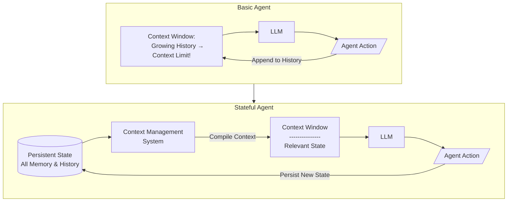

Large Language Models have given us powerful building blocks for intelligent systems.
By connecting these models to external tools, we can create AI agents that take actions and affect the real world.

Most LLM agents today are held back by a fundamental limitation: while LLMs provide the intelligence, they are inherently stateless - processing each input without memory of past interactions.
Simply accumulating conversation history leads to agents that lose track of important information or need their memory regularly cleared to continue functioning.

Building truly intelligent agents requires sophisticated context management - the missing piece that transforms stateless LLMs into agents that can intelligently process vast knowledge bases and continuously learn from their experiences.

## Stateful Agents

When an LLM agent interacts with the world, it accumulates state - learned behaviors, facts about its environment, and memories of past interactions.
A stateful agent is one that can effectively manage this growing knowledge, maintaining consistent behavior while incorporating new experiences.

Stateful agents use intelligent context management to organize and prioritize information, enabling them to process large amounts of data while maintaining focus on what's relevant.
This is a fundamental shift from traditional approaches that simply accumulate information until the agent becomes overwhelmed.

Letta provides the foundation for building stateful agents through its context management system.
By handling the complexity of state management, Letta lets you (the developer) focus on building agents that can truly learn and evolve through their interactions with the world.
