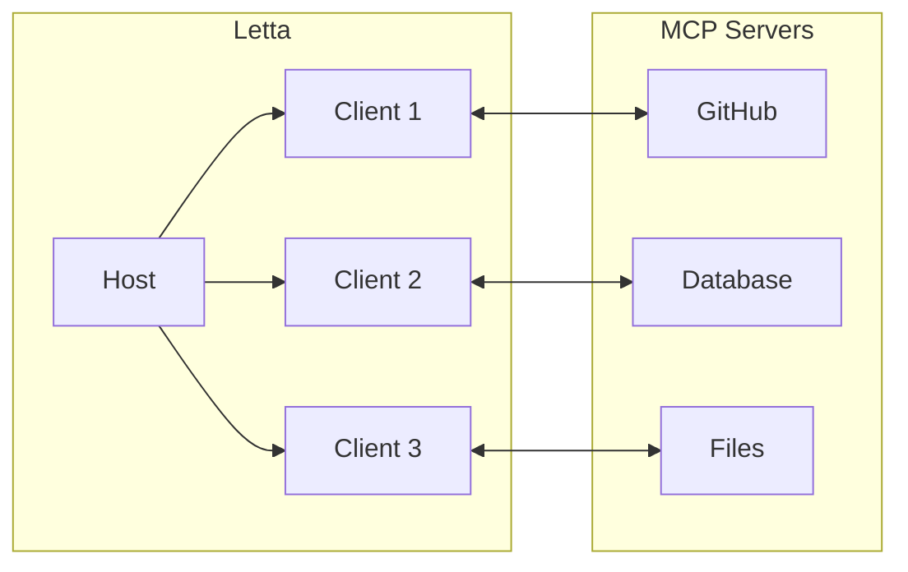

[Model Context Protocol (MCP)](https://modelcontextprotocol.io) is an open protocol that enables seamless integration between LLM applications and external data sources and tools.
In Letta, you can create your own [custom tools](/guides/agents/custom-tools) that run in the Letta tool sandbox, or use MCP to connect to tools that run on external servers.

**Already familiar with MCP?** Jump to the [setup guide](/guides/mcp/setup).

## Architecture

MCP uses a **host-client-server** model. Letta acts as the **host**, creating **clients** that connect to external **servers**. Each server exposes tools, resources, or prompts through the standardized MCP protocol.

Letta's MCP integration connects your agents to external tools and data sources without requiring custom integrations.

## Integration Flow

Letta creates isolated clients for each MCP server, maintaining security boundaries while providing agents access to specialized capabilities.

## Connection Methods

- **ADE**: Point-and-click server management through Letta's web interface
- **API/SDK**: Programmatic integration for production deployments

<Note>
**Letta Cloud**: Streamable HTTP and SSE only

**Self-hosted**: All transports (stdio, HTTP, SSE)
</Note>

## Benefits

<Warning>
Make sure your trust the MCP server you're using.
Never connect your agent to an MCP server that you don't trust.
</Warning>

MCP servers are a great way to connect your agents to rich tool libraries.
Without MCP, if you want to create a new tool to your agent (e.g., give your agent the ability to search the web), you would need to write a custom tool in Python that calls an external web search API.
Letta lets you build arbitrarily complex tools, which can be very powerful, but it also requires you to write your own tool code - with MCP, you can use pre-made tools by picking pre-made MCP servers and connecting them to Letta.

## Next Steps

Ready to connect? See the [setup guide](/guides/mcp/setup).
