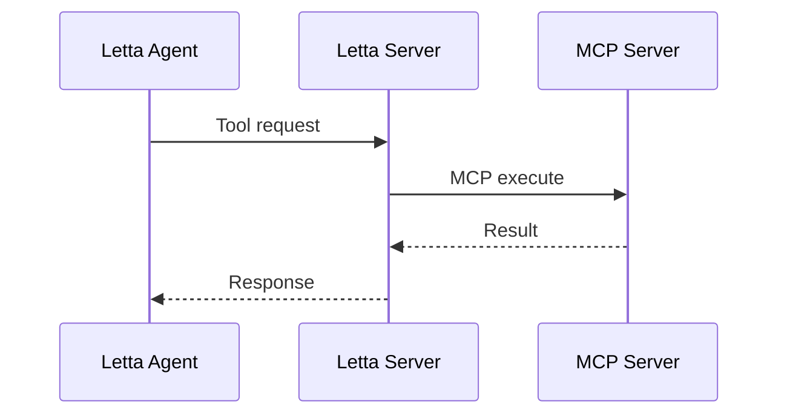

<Warning>
Letta no longer supports legacy `.json` configuration files. Use the ADE or API/SDK.
</Warning>

Letta supports three MCP transport types depending on your deployment and use case.

## Connection Methods

- **ADE**: Point-and-click server management via web interface
- **API/SDK**: Programmatic integration for production

## Transport Types

- **Streamable HTTP** (Recommended): Production-ready with auth support. Works on Cloud + self-hosted.
- **SSE** (Legacy): Deprecated but supported for compatibility.
- **stdio** (Self-hosted only): Local development and testing.

| Transport | Cloud | Self-hosted |
|-----------|-------|-------------|
| Streamable HTTP | ✅ | ✅ |
| SSE | ✅ | ✅ |
| stdio | ❌ | ✅ |

## Tool Execution Flow

## Quick Start

1. Choose transport type based on your deployment
2. Connect via ADE: Tool Manager → Add MCP Server
3. Attach tools to agents

See [remote servers](/guides/mcp/remote) or [local servers](/guides/mcp/local) for detailed setup.
