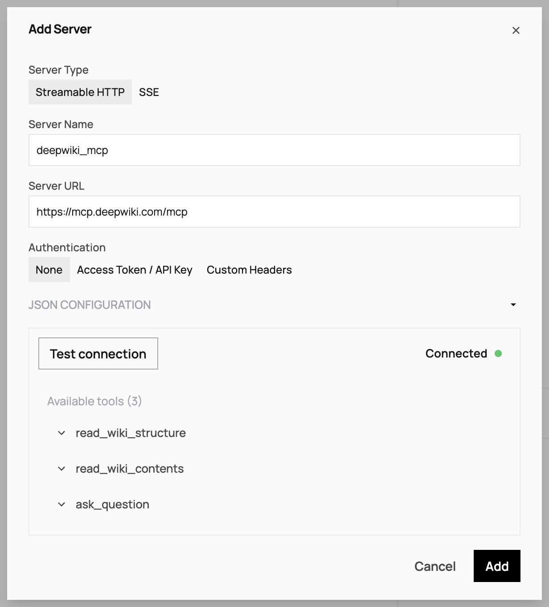

Remote MCP servers work with both Letta Cloud and self-hosted deployments. Streamable HTTP is recommended for new integrations; SSE is deprecated but supported for legacy compatibility.

## Streamable HTTP

Streamable HTTP is the recommended transport with support for MCP servers that use Bearer authorization, API keys, or OAuth 2.1. Letta also supports passing in custom headers for additional configuration.


**ADE**: Tool Manager → Add MCP Server → Streamable HTTP

### Agent Id Header

When Letta makes tool calls to an MCP server, it includes the following in the HTTP request header:

- **`x-agent-id`**: The ID of the agent making the tool call

If you're implementing your own MCP server, this can be used to make requests against your Letta Agent via our API/SDK.

### Agent Scoped Variables

Letta recognizes templated variables in the custom header and auth token fields to allow for agent-scoped parameters defined in your [tool variables](/guides/agents/tool-variables):
- For example, **`{{ AGENT_API_KEY }}`** will use the `AGENT_API_KEY` tool variable if available.
- To provide a default value, **`{{ AGENT_API_KEY | api_key }}`** will fallback to `api_key` if `AGENT_API_KEY` is not set.
- This is supported in the ADE as well when configuring API key/access tokens and custom headers.

<CodeGroup>
```python title="python" maxLines=50
from letta_client import Letta
from letta_client.types import StreamableHTTPServerConfig, MCPServerType

client = Letta(token="LETTA_API_KEY")

# Connect a Streamable HTTP server with Bearer token auth
streamable_config = StreamableHTTPServerConfig(
    server_name="my-server",
    type=MCPServerType.STREAMABLE_HTTP,
    server_url="https://mcp-server.example.com/mcp",
    auth_header="Authorization",
    auth_token="Bearer your-token",  # Include "Bearer " prefix
    custom_headers={"X-API-Version": "v1"}  # Additional custom headers
)

client.tools.add_mcp_server(request=streamable_config)

# Example with templated variables for agent-scoped authentication
agent_scoped_config = StreamableHTTPServerConfig(
    server_name="user-specific-server",
    type=MCPServerType.STREAMABLE_HTTP,
    server_url="https://api.example.com/mcp",
    auth_header="Authorization",
    auth_token="Bearer {{AGENT_API_KEY | api_key}}",  # Agent-specific API key
    custom_headers={
        "X-User-ID": "{{AGENT_API_KEY | user_id}}",  # Agent-specific user ID
        "X-API-Version": "v2"
    }
)

client.tools.add_mcp_server(request=agent_scoped_config)
```
```typescript title="node.js" maxLines=50
import { LettaClient, Letta } from '@letta-ai/letta-client';

const client = new LettaClient({ token: "LETTA_API_KEY" });

// Connect a Streamable HTTP server with Bearer token auth
const streamableConfig: Letta.StreamableHttpServerConfig = {
    serverName: "my-server",
    type: Letta.McpServerType.StreamableHttp,
    serverUrl: "https://mcp-server.example.com/mcp",
    authHeader: "Authorization",
    authToken: "Bearer your-token",  // Include "Bearer " prefix
    customHeaders: {
        "X-API-Version": "v1"  // Additional custom headers
    }
};

await client.tools.addMcpServer(streamableConfig);

// Example with templated variables for agent-scoped authentication
const agentScopedConfig: Letta.StreamableHttpServerConfig = {
    serverName: "user-specific-server",
    type: Letta.McpServerType.StreamableHttp,
    serverUrl: "https://api.example.com/mcp",
    authHeader: "Authorization",
    authToken: "Bearer {{AGENT_API_KEY | api_key}}",  // Agent-specific API key
    customHeaders: {
        "X-User-ID": "{{AGENT_API_KEY | user_id}}",  // Agent-specific user ID
        "X-API-Version": "v2"
    }
};

await client.tools.addMcpServer(agentScopedConfig);
```
</CodeGroup>

## SSE (Deprecated)

<Warning>
SSE is deprecated. Use Streamable HTTP for new integrations if available.
</Warning>

For legacy MCP servers that only support SSE.

**ADE**: Tool Manager → Add MCP Server → SSE

### Agent Id Header

When Letta makes tool calls to an MCP server, it includes the following in the HTTP request header:

- **`x-agent-id`**: The ID of the agent making the tool call

If you're implementing your own MCP server, this can be used to make requests against your Letta Agent via our API/SDK.

### Agent Scoped Variables

Letta recognizes templated variables in the custom header and auth token fields to allow for agent-scoped parameters defined in your [tool variables](/guides/agents/tool-variables):
- For example, **`{{ AGENT_API_KEY }}`** will use the `AGENT_API_KEY` tool variable if available.
- To provide a default value, **`{{ AGENT_API_KEY | api_key }}`** will fallback to `api_key` if `AGENT_API_KEY` is not set.
- This is supported in the ADE as well when configuring API key/access tokens and custom headers.

<CodeGroup>
```python title="python" maxLines=50
from letta_client import Letta
from letta_client.types import SseServerConfig, MCPServerType

client = Letta(token="LETTA_API_KEY")

# Connect a SSE server (legacy)
sse_config = SseServerConfig(
    server_name="legacy-server",
    type=MCPServerType.SSE,
    server_url="https://legacy-mcp.example.com/sse",
    auth_header="Authorization",
    auth_token="Bearer optional-token"  # Include "Bearer " prefix
    custom_headers={
        "X-User-ID": "{{AGENT_API_KEY | user_id}}",  # Agent-specific user ID
        "X-API-Version": "v2"
    }
)

client.tools.add_mcp_server(request=sse_config)
```
```typescript title="node.js" maxLines=50
import { LettaClient, Letta } from '@letta-ai/letta-client';

const client = new LettaClient({ token: "LETTA_API_KEY" });

// Connect a SSE server (legacy)
const sseConfig: Letta.SseServerConfig = {
    serverName: "legacy-server",
    type: Letta.McpServerType.Sse,
    serverUrl: "https://legacy-mcp.example.com/sse",
    authHeader: "Authorization",
    authToken: "Bearer optional-token"  // Include "Bearer " prefix
    customHeaders: {
        "X-User-ID": "{{AGENT_API_KEY | user_id}}",  // Agent-specific user ID
        "X-API-Version": "v2"
    }
};

await client.tools.addMcpServer(sseConfig);
```
</CodeGroup>


## Using MCP Tools

**ADE**: Agent → Tools → Select MCP tools

<CodeGroup>
```python title="python" maxLines=50
from letta_client import Letta

client = Letta(token="LETTA_API_KEY")

# List tools from an MCP server
tools = client.tools.list_mcp_tools_by_server(mcp_server_name="weather-server")

# Add a specific tool from the MCP server
tool = client.tools.add_mcp_tool(
    mcp_server_name="weather-server",
    mcp_tool_name="get_weather"
)

# Create agent with MCP tool attached
agent_state = client.agents.create(
    model="openai/gpt-4o-mini",
    embedding="openai/text-embedding-3-small",
    tool_ids=[tool.id]
)

# Or attach tools to an existing agent
client.agents.tool.attach(
    agent_id=agent_state.id
    tool_id=tool.id
)

# Use the agent with MCP tools
response = client.agents.messages.create(
    agent_id=agent_state.id,
    messages=[
        {
            "role": "user",
            "content": "Use the weather tool to check the forecast"
        }
    ]
)
```
```typescript title="node.js" maxLines=50
import { LettaClient } from '@letta-ai/letta-client'

const client = new LettaClient({ token: "LETTA_API_KEY" });

// List tools from an MCP server
const tools = await client.tools.listMcpToolsByServer("weather-server");

// Add a specific tool from the MCP server
const tool = await client.tools.addMcpTool("weather-server", "get_weather");

// Create agent with MCP tool
const agentState = await client.agents.create({
    model: "openai/gpt-4o-mini",
    embedding: "openai/text-embedding-3-small",
    toolIds: [tool.id]
});

// Use the agent with MCP tools
const response = await client.agents.messages.create(agentState.id, {
    messages: [
        {
            role: "user",
            content: "Use the weather tool to check the forecast"
        }
    ]
});
```
</CodeGroup>
