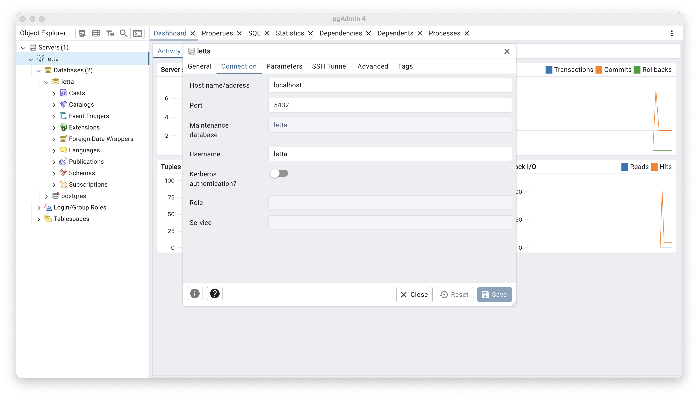

If you'd like to directly view the contents of your Letta server's database, you can connect to it via [pgAdmin](https://www.pgadmin.org/).

If you're using Docker, you'll need to make sure you expose port `5432` from the Docker container to your host machine by adding `-p 5432:5432` to your `docker run` command:
```sh
# replace `~/.letta/.persist/pgdata` with wherever you want to store your agent data
docker run \
  -v ~/.letta/.persist/pgdata:/var/lib/postgresql/data \
  -p 8283:8283 \
  -p 5432:5432 \
  -e OPENAI_API_KEY="your_openai_api_key" \
  letta/letta:latest
```

Once you expose port `5432`, you will be able to connect to the container's internal PostgreSQL instance.
The default configuration uses `letta` as the database name / user / password, and `5432` as the port, which is what you'll use to connect via pgAdmin:

