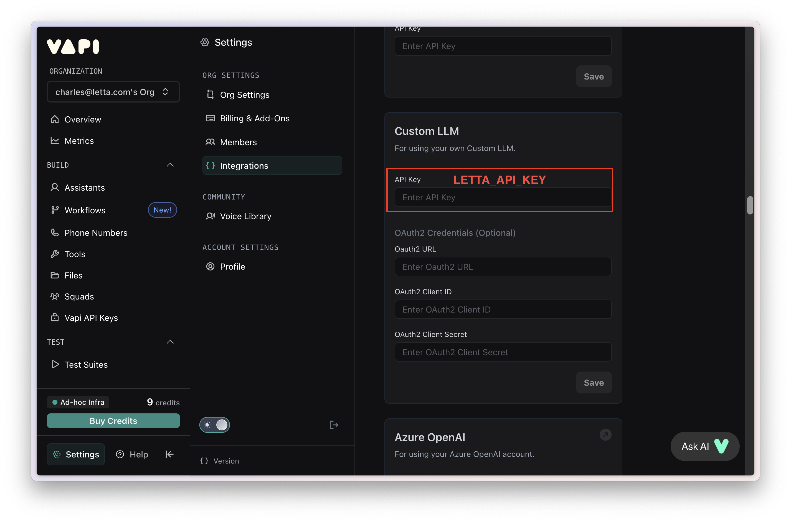
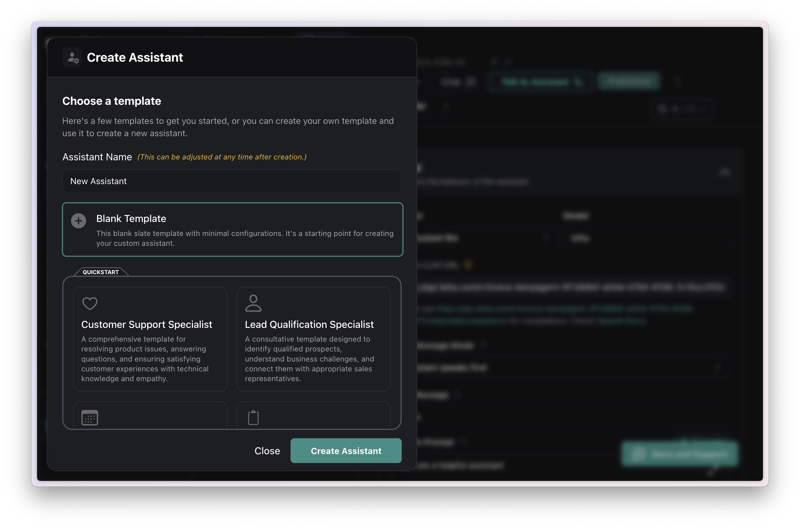
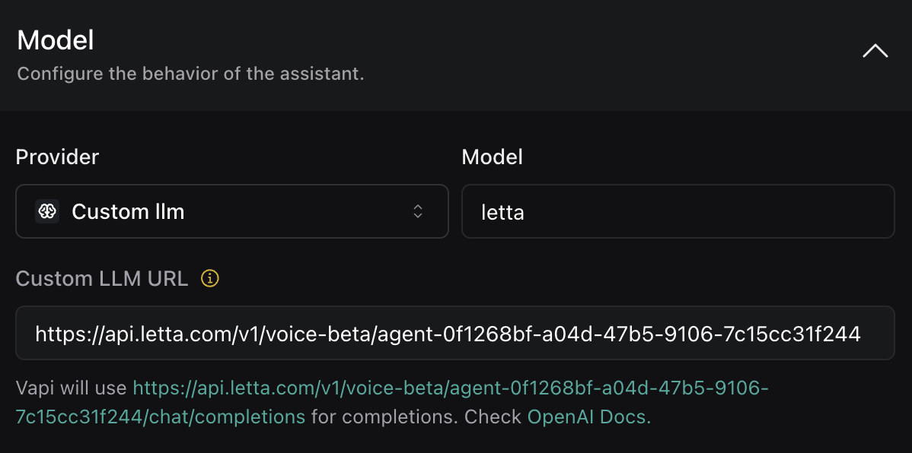

## Connecting to Letta Cloud
<Steps>
  <Step title="Add your `LETTA_API_KEY`">
  Add Letta Cloud as an integration by entering your `LETTA_API_KEY` into the "Custom LLM" field at https://dashboard.vapi.ai/settings/integrations.
 
  </Step>
  <Step title="Create an assistant">
  Create a Vapi assistant at https://dashboard.vapi.ai/assistants/ and use the "Blank Template".
 
  </Step>
  <Step title="Connect your Letta agent">
  Select "Custom LLM" for the model, and enter in the voice endpoint for your agent: https://api.letta.com/v1/voice-beta/{AGENT-ID}

 

 <Note>The "Model" field will be ignored (since your `agent_id` is already configured with a model in Letta), so can be any value. </Note>
  </Step>
  <Step title="Talk to your agent">
  You can now interact with your agent through Vapi, including calling and texting your agent!
  </Step>

</Steps>

## Connecting to a self-hosted Letta server
To connect to a self-hosted server, you will need to have a internal accessible endpoint for your Letta server and add any authentication tokens (if they exist) instead of `LETTA_API_KEY`. We recommend using ngrok to expose your Letta server to the internet.

<Steps>
<Step title="Setting up `ngrok`">
If you are self-hosting the Letta server locally (at `localhost`), you will need to use `ngrok` to expose your Letta server to the internet:
1. Create an account on [ngrok](https://ngrok.com/)
2. Create an auth token and add it into your CLI
```
ngrok config add-authtoken <YOUR_AUTH_TOKEN>
```
3. Point your ngrok server to your Letta server:
```
ngrok http http://localhost:8283
```
Now, you should have a forwarding URL like `https://{YOUR_FORWARDING_URL}.ngrok.app`.
</Step>
  <Step title="Create an assistant">
  Create a Vapi assistant at https://dashboard.vapi.ai/assistants/ and use the "Blank Template".
 
  </Step>
  <Step title="Connect your Letta agent">
  Select "Custom LLM" for the model, and enter in the voice endpoint for your agent: `https://{YOUR_FORWARDING_URL}.ngrok.app/v1/voice-beta/{AGENT_ID}`

 <Note>The "Model" field will be ignored (since your `agent_id` is already configured with a model in Letta), so can be any value. </Note>
  </Step>
  <Step title="Talk to your agent">
  You can now interact with your agent through Vapi, including calling and texting your agent!
  </Step>
</Steps>
